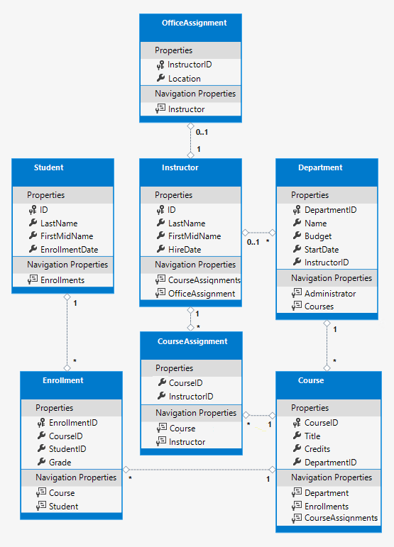

- [Basic Ntier Template](#basic-ntier-template)
  - [Version compatibility](#version-compatibility)
    - [Table: .NET Core](#table-net-core)
    - [Table: MVC](#table-mvc)
    - [Table: Angular](#table-angular)
  - [Installation Requirements](#installation-requirements)
  - [Solution Architecture](#solution-architecture)
    - [Table: Architecture Layers](#table-architecture-layers)
    - [Cross-Cutting Concerns For All Layers](#cross-cutting-concerns-for-all-layers)
    - [Clean Architecture Layer Breakdown (Different Than Template Variant)](#clean-architecture-layer-breakdown-different-than-template-variant)
      - [Key Mapping Notes: CA Vs N-Tier](#key-mapping-notes-ca-vs-n-tier)
    - [Diagram: N-Tier Architecture](#diagram-n-tier-architecture)
    - [Notes](#notes)
  - [Template Installation](#template-installation)
    - [Nuget Installation](#nuget-installation)
    - [Local Repository Installation](#local-repository-installation)
    - [Installation Commands](#installation-commands)
  - [Entity Framework Core](#entity-framework-core)
    - [Code-First](#code-first)
    - [Database-First (Database Scaffolding, or Reverse Engineering)](#database-first-database-scaffolding-or-reverse-engineering)
      - [Additional Commands](#additional-commands)
    - [Example: `Contoso University` Tutorial Example](#example-contoso-university-tutorial-example)
  - [Configuration Information](#configuration-information)
    - [Connection String](#connection-string)
    - [AutoMapper Use](#automapper-use)
  - [Troubleshooting](#troubleshooting)
    - [HTTPS Developer Ccertificate](#https-developer-ccertificate)
  - [Education](#education)
    - [Readings](#readings)
    - [Video Tutorials](#video-tutorials)
    - [Other Custom .NET Solution Templates](#other-custom-net-solution-templates)
    - [Recommended Tools](#recommended-tools)
    - [Clean Architecture Information](#clean-architecture-information)
      - [Readings (CA)](#readings-ca)
      - [Video Tutorials (CA)](#video-tutorials-ca)

---

> **🛑 STILL UNDER DEVELOPMENT - USE WITH CAUTION 🛑**

# Basic Ntier Template

<https://github.com/carloswm85/basic-ntier-template>

## Version compatibility

### Table: .NET Core

| Current | .NET Core | .NET Core release type | EF Core  |
| ------- | --------- | ---------------------- | -------- |
| ✅      | `8.0.100` | LTS                    | `8.0.22` |
|         | `9`       | STS                    | -        |
|         | `10`      | pre-release            | -        |

[.NET and .NET Core Support Policy](https://dotnet.microsoft.com/en-us/platform/support/policy/dotnet-core) ↗

### Table: MVC

| Current | Bootstrap | jQuery  | jQuery Validate | Jquery Validation Unobtrusive |
| ------- | --------- | ------- | --------------- | ----------------------------- |
| ✅      | `5.3.8`   | `3.7.1` | `1.21.0`        | `4.0.0`                       |

- Used `libman.json` for client side libraries.
- Bootstrap `+5.x` does not depend on `jQuery`.

### Table: Angular

| Current | Angular Version      | Node.js Version                       | TypeScript Version | RxJS Version         |
| ------- | -------------------- | ------------------------------------- | ------------------ | -------------------- |
|         | `20.2.x` or `20.3.x` | `^20.19.0` or `^22.12.0` or `^24.0.0` | `>=5.9.0 <6.0.0`   | `^6.5.3` or `^7.4.0` |
|         | `20.0.x` or `20.1.x` | `^20.19.0` or `^22.12.0` or `^24.0.0` | `>=5.8.0 <5.9.0`   | `^6.5.3` or `^7.4.0` |
| ✅      | `19.2.x`             | `^18.19.1` or `^20.11.1` or `^22.0.0` | `>=5.5.0 <5.9.0`   | `^6.5.3` or `^7.4.0` |
|         | `19.1.x`             | `^18.19.1` or `^20.11.1` or `^22.0.0` | `>=5.5.0 <5.8.0`   | `^6.5.3` or `^7.4.0` |
|         | `19.0.x`             | `^18.19.1` or `^20.11.1` or `^22.0.0` | `>=5.5.0 <5.7.0`   | `^6.5.3` or `^7.4.0` |
|         | `18.1.x` or `18.2.x` | `^18.19.1` or `^20.11.1` or `^22.0.0` | `>=5.4.0 <5.6.0`   | `^6.5.3` or `^7.4.0` |
|         | `18.0.x`             | `^18.19.1` or `^20.11.1` or `^22.0.0` | `>=5.4.0 <5.5.0`   | `^6.5.3` or `^7.4.0` |

---

## Installation Requirements

- [Installation requirements](./docs/content/installation-requirements.md)

---

## Solution Architecture

### Table: Architecture Layers

| Level | Layers        | Classification                     | Role                                                                             | Functionality                                                              | Technology/Notes                                                                           | Dependencies       | Clean Architecture Equivalence (_approximate_)                                              |
| ----- | ------------- | ---------------------------------- | -------------------------------------------------------------------------------- | -------------------------------------------------------------------------- | ------------------------------------------------------------------------------------------ | ------------------ | ------------------------------------------------------------------------------------------- |
| 1     | `Data`        | -                                  | Define database schema, manage migrations, and entity mapping.                   | Database schema, migrations, models, database seeding data                 | Entity Framework Core, Identity API, SQL Server/PostgreSQL                                 | `None`             | **Infrastructure Layer** (Persistence)                                                      |
| 2     | `Repository`  | -                                  | Abstract data access logic to decouple the service layer from EF Core specifics. | Data access abstraction, caching, Unit of Work Pattern, Repository Pattern | IUserRepository, IProductRepository, Redis/In-Memory Cache                                 | `Data`             | **Infrastructure Layer** (Implementations) / **Application Layer** (Interfaces)             |
| 3     | `Service`     | Business logic                     | Implement business logic, enforce rules and validation.                          | Business logic, validation, orchestration                                  | FluentValidation, async/await patterns, domain services                                    | `Repository`       | **Application Layer** (Use Cases/Application Services) + **Domain Layer** (Domain Services) |
| 4.a   | `API`         | Request handling, Dev presentation | Expose business services as RESTful endpoints.                                   | RESTful API, documentation, API interface                                  | ASP\.NET Core Web API, Swagger/OpenAPI, API versioning, JWT authentication                 | `Service`          | **Presentation Layer** (API Controllers/Endpoints)                                          |
| 4.b   | `Web.MVC`     | User presentation                  | Traditional server-rendered UI using MVC and Razor Pages.                        | Server-side rendering, UI logic, form handling                             | ASP\.NET Core MVC, Razor Pages, ViewModels, Tag Helpers                                    | `Service` or `API` | **Presentation Layer** (MVC Controllers/Views)                                              |
| 4.c   | `Web.Angular` | User presentation                  | Modern client-side SPA experience.                                               | Client-side SPA, dynamic UI, state management                              | Angular (TypeScript), RxJS, HttpClient, REST API integration, Component-based architecture | `API`              | **Presentation Layer** (UI Components)                                                      |

### Cross-Cutting Concerns For All Layers

These span multiple layers:

- **Logging**: Serilog, NLog (all layers)
- **Authentication/Authorization**: ASP\.NET Core Identity, JWT (API, Web.MVC, Web.Angular)
- **Error Handling**: Global exception filters, middleware (API, Web.MVC)
- **Dependency Injection**: Built-in ASP\.NET Core DI container (all layers)

### Clean Architecture Layer Breakdown (Different Than Template Variant)

**Clean Architecture follows the Dependency Rule: dependencies point inward, toward the Domain.**

`BasicNtierTemplate` is a Clean Architecture variant. For better understanding, we'll highlight here the similarities between the two.

1. **Domain Layer (Core)** - Innermost layer, no dependencies

   - Enterprise business rules
   - Domain entities and value objects
   - Domain services (part of `Service` layer)
   - Domain events

2. **Application Layer** - Depends only on Domain

   - Application business rules
   - Use cases / Application services (part of `Service` layer)
   - Repository interfaces (defined here, implemented in Infrastructure)
   - DTOs, validators, orchestration logic

3. **Infrastructure Layer** - Depends on Application & Domain

   - External concerns: database, file system, web services
   - Equivalent to `Data` layer (EF Core, migrations, DbContext)
   - Equivalent to `Repository` implementations
   - Caching, logging, email services
   - Third-party integrations

4. **Presentation Layer** - Depends on Application
   - User interface concerns
   - Equivalent to `API`, `Web.MVC`, and `Web.Angular` layers
   - Controllers, views, API endpoints
   - Input validation, authentication/authorization middleware
   - Presentation models (ViewModels, DTOs for API responses)

#### Key Mapping Notes: CA Vs N-Tier

- **`Service` layer spans two Clean Architecture layers**: Domain services belong to the Domain Layer, while application services (use cases) belong to the Application Layer.
- **Repository pattern spans layers**: Interfaces are defined in the Application Layer, but implementations live in the Infrastructure Layer.
- **Ntier Architecture is practical**: While Clean Architecture is more granular with 4 distinct layers, a 4-tier(ish) approach (`Data`/`Repository`/`Service`/`Presentation(API and Web)`) is a pragmatic implementation that achieves similar goals with less complexity for many applications.

### Diagram: N-Tier Architecture

- _Diagram made using [mermaid.js](https://mermaid.js.org/)_


### Notes

- Data Layer:
  - Etity Framework Core, with code-first and database-first support.
- Repository:
  - Define interfaces for repositories (e.g., IUserRepository) which support CRUD and query operations asynchronously.
  - Caching: Caching strategies, or as a decorator pattern, to optimize repeated data retrieval.
  - Unit of Work Pattern: Aggregate repository transactions ensuring atomicity.

---

## Template Installation

### Nuget Installation

TODO

### Local Repository Installation

1. Clone or download repository.
1. Install from local folder.
1. At root level `basic-ntier-template` run:

   ```powershell
   # basic-ntier-template\.
   dotnet new install .
   ```

   Or:

   ```powershell
   # basic-ntier-template\.
   dotnet new uninstall .
   ```

1. Use the template from anywhere:

```powershell
dotnet new basic-ntier-template -o "BasicNtierTemplateExample"
```

### Installation Commands

```powershell
-o # Custom solution name
```

---

## Entity Framework Core

Be sure you have the right tools: [Installation requirements](./docs/content/installation-requirements.md)

### Code-First

- Using PowerShell:

  - Inside the `BasicNtierTemplate.Data` project folder run:

  ```powershell
  > dotnet ef migrations add InitialMigration
  > dotnet ef database update
  ```

- Using Package Manager Console:

  - Set "Default Project" to `BasicNtierTemplate.Data`, and run:

  ```console
  PM> Add-Migration InitialMigration
  PM> Update-Database
  ```

### Database-First (Database Scaffolding, or Reverse Engineering)

Your database should be named `MyDatabaseDb` for scaffolding to work out-of-the-box. Otherwise, you will need to modify the some parts of the code to make it work.

<https://learn.microsoft.com/en-us/ef/core/managing-schemas/scaffolding/>

- Inside the `BasicNtierTemplate.Data` project folder, using Package Manager Console:

  - When using directly the connection string in the command line:

  ```console
  PM> Scaffold-DbContext "Server=.;Database=BasicNtierTemplateDb;user id=SomeUser;password=ThisIsSomePassword;Trusted_Connection=True;TrustServerCertificate=True" Microsoft.EntityFrameworkCore.SqlServer -OutputDir Model
  ```

  - When extracting the connection string from `appsettings.json` in the `BasicNtierTemplate.API` project:

  ```console
  PM> Scaffold-DbContext "Name=BasicNtierTemplateConnection" Microsoft.EntityFrameworkCore.SqlServer -OutputDir Model
  ```

The previous command will overrite the existing `BasicNtierTemplateContext.cs` file.

#### Additional Commands

```console
PM>  Scaffold-DbContext "Name=BasicNtierTemplateConnection" Microsoft.EntityFrameworkCore.SqlServer -OutputDir Model -Project BasicNtierTemplate.Data -StartupProject BasicNtierTemplate.API -Force -UseDatabaseNames -NoPluralize
```

Or using .NET Core CLI:

```console
dotnet ef dbcontext scaffold "Name=BasicNtierTemplateConnection" Microsoft.EntityFrameworkCore.SqlServer --output-dir Model --project BasicNtierTemplate.Data --startup-project BasicNtierTemplate.API --force --use-database-names --no-pluralize
```

---

### Example: `Contoso University` Tutorial Example

- This template has a built in example case for use and testing of database, EF Core, API endpoints and MVC frontend.
- The example is partially completed.
- For additional information on this example, see the official tutorial: <https://learn.microsoft.com/en-us/aspnet/core/data/ef-mvc/?view=aspnetcore-8.0>



---

## Configuration Information

### Connection String

```json
{
  ConnectionStrings": {
    "DefaultConnection": "Server=.;Database=BasicNtierTemplateData;Trusted_Connection=True;MultipleActiveResultSets=true;TrustServerCertificate=True"
  }
}
```

1. `Server=.;`

   - Specifies the SQL Server instance to connect to.
   - Selected server is: `Default Server`

2. `Database=BasicNtierTemplateData;`

   - Name of the **database** you want to connect to.

3. `Trusted_Connection=True;`

   - Uses **Windows Authentication** (your Windows user credentials) instead of a SQL username/password.

4. `MultipleActiveResultSets=true;`

   - Enables **MARS**, allowing multiple queries to be active on the same connection at once (useful for EF and lazy loading).

5. `TrustServerCertificate=True;`

   - Skips certificate validation when using **encrypted connections** — useful for local or development setups where SSL certificates may not be trusted.

_Remember to change it for secure production-ready version (with SQL login and safer defaults)._

### AutoMapper Use

```terminal
YourApp.Api/  (Presentation)
├── Program.cs  → builder.Services.AddAutoMapper()
└── [References Service Layer]

YourApp.Services/  (Business Logic)
├── Mappings/
│   └── UserProfile.cs  → Profile classes
├── UserService.cs  → Uses IMapper
└── [Needs: AutoMapper package]

YourApp.Data/  (Data Access)
└── [No AutoMapper needed here]
```

---

## Troubleshooting

### HTTPS Developer Ccertificate

```powershell
> dotnet dev-certs https --clean
> dotnet dev-certs https --trust
> dotnet dev-certs https --check
```

---

## Education

### Readings

Official documentation:

- [Tutorial: Create a project template](https://learn.microsoft.com/en-us/dotnet/core/tutorials/cli-templates-create-project-template)
- [Manage .NET project and item templates](https://learn.microsoft.com/en-us/dotnet/core/install/templates)
- [Default templates for `dotnet new`](https://learn.microsoft.com/en-us/dotnet/core/tools/dotnet-new-sdk-templates)
- [Custom templates for `dotnet new`](<[https://](https://learn.microsoft.com/en-us/dotnet/core/tools/custom-templates)>)
- Templating syntax:
  - <https://github.com/dotnet/templating/wiki/Conditional-processing-and-comment-syntax>

Other documentation:

- <https://www.entityframeworktutorial.net/efcore/entity-framework-core.aspx>

### Video Tutorials

- [How To Create Your Own Templates in NET](https://youtu.be/rdWZo5PD9Ek)

### Other Custom .NET Solution Templates

Good:

- <https://github.com/jasontaylordev/CleanArchitecture>
- <https://github.com/ardalis/CleanArchitecture>

Average:

- <https://github.com/dorlugasigal/MiniClean.Template>

### Recommended Tools

- <https://marketplace.visualstudio.com/items?itemName=ErikEJ.EFCorePowerTools>

### Clean Architecture Information

#### Readings (CA)

- [The Clean Architecture](https://blog.cleancoder.com/uncle-bob/2012/08/13/the-clean-architecture.html), by Uncle Bob

#### Video Tutorials (CA)

1. [Clean Architecture with ASP.NET Core 3.0 - Jason Taylor - NDC Sydney 2019](https://www.youtube.com/watch?v=5OtUm1BLmG0)
2. [💻 Clean Architecture (by Syntax Async)](https://www.youtube.com/playlist?list=PLlKSF1mm1dufAZmGexWGnORX-yKiGpFjM) playlist
