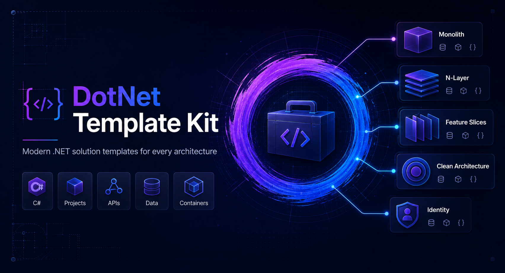

- [DotNet Template Kit](#dotnet-template-kit)
  - [1. Available Templates](#1-available-templates)
    - [1.1 Recommended Learning Path](#11-recommended-learning-path)
  - [2. Available Branches](#2-available-branches)
  - [3. Additional Documentation](#3-additional-documentation)
    - [DKT Documentation](#dkt-documentation)
    - [Architecture](#architecture)

---

---

# DotNet Template Kit

<https://github.com/carloswm85/dotnet-template-kit>

**Introduction**:

- Dot Net solution templates for different architectures.

---

## 1. Available Templates

| #      | Name                                          | Status | When to Use (recommendation)                                                                                                                                                         | Docs                                                                  |
| ------ | --------------------------------------------- | ------ | ------------------------------------------------------------------------------------------------------------------------------------------------------------------------------------ | --------------------------------------------------------------------- |
| `SMA`  | **Simple Monolith Architecture**              | 🟢     | CRUD apps, internal tools, MVPs                                                                                                                                                      | [README.md](./templates/SimpleMonolithArchitectureTemplate/README.md) |
| `BNLA` | **Basic N-Layer Architecture**                | 🟢     | Small to medium projects, learning/prototyping, simple CRUD apps with limited business complexity.                                                                                   | [README.md](./templates/BasicNLayerTemplate/README.md)                |
| `CNLA` | **Complex N-Layer Architecture**              | 🟢     | Enterprise applications, large teams, long-term maintainability. N-Layer Architecture with **Unit of Work** and **Repository** design patterns. It also includes an Angular project. | [README.md](./templates/ComplexNLayerTemplate/README.md)              |
| `VSA`  | **Vertical Slice Architecture**               | 🟡     | APIs with many independent endpoints, microservices, modular monoliths.                                                                                                              | [README.md](./templates/VerticalSliceTemplate/README.md)              |
| `CNA`  | **Clean Architecture**                        | 🟠     | Domain-rich applications, teams prioritizing testability and strict dependency rules.                                                                                                | [README.md](./templates/CleanArchitectureTemplate/README.md)          |
| `HGA`  | **Hexagonal Architecture** (Ports & Adapters) | 🟠     | Systems with multiple I/O adapters (REST, CLI, messaging), high infrastructure replaceability need.                                                                                  | [README.md](./templates/HexagonalArchitectureTemplate/README.md)      |
| `ONA`  | **Onion Architecture**                        | 🟠     | DDD-aligned projects, complex domain logic needing strong layer isolation and inversion of control.                                                                                  | [README.md](./templates/OnionArchitectureTemplate/README.md)          |

🟠 = Planned, 🟡 = In Progress, 🟢 = Finished, 🔴 = Blocked/Unfinished

### 1.1 Recommended Learning Path

| #   | Architecture | Note                |
| --- | ------------ | ------------------- |
| 1   | `SMA`        | -                   |
| 2   | `BNLA`       | Simpler than `CNLA` |

The other architecture will be listed once they are finished.

---

## 2. Available Branches

| Branch                   | Content/Stack                                                                                                                                        | Status | Link                                                                                |
| ------------------------ | ---------------------------------------------------------------------------------------------------------------------------------------------------- | ------ | ----------------------------------------------------------------------------------- |
| `main`                   | NET Core 10 solution templates, production ready content only                                                                                        | 🟢     | [🔗](https://github.com/carloswm85/dotnet-template-kit/)                            |
| `dkt-netcore10`          | NET Core 10 content                                                                                                                                  | 🟢     | [🔗](https://github.com/carloswm85/dotnet-template-kit/tree/dkt-netcore10)          |
| `dkt-netcore10-identity` | NET Core 10 content, `CNLA` only, with [Identity API](https://learn.microsoft.com/en-us/aspnet/core/security/authentication/identity) implementation | 🟢     | [🔗](https://github.com/carloswm85/dotnet-template-kit/tree/dkt-netcore10-identity) |
| `dkt-netcore8`           | NET Core 8 content, `CNLA` only                                                                                                                      | 🟢     | [🔗](https://github.com/carloswm85/dotnet-template-kit/tree/dkt-netcore8)           |

`dev-*` is used for development versions.

---

## 3. Additional Documentation

### DKT Documentation

- [README.md](./docs/README.md)

### Architecture

- Microsoft documentation:
  - <https://learn.microsoft.com/en-us/dotnet/architecture/modern-web-apps-azure/>
  - <https://learn.microsoft.com/en-us/azure/architecture/>
- Architectures:
  - **Simple Monolith Architecture**
    - ?
  - **Basic N-Layer Architecture**
    - ?
  - **Complex N-Layer Architecture**
    - ?
  - **Vertical Slice Architecture**
    - ?
  - **Clean Architecture**
    - ?
  - **Hexagonal Architecture** (Ports & Adapters)\*\*
    - ?
  - **Onion Architecture**
    - ?
