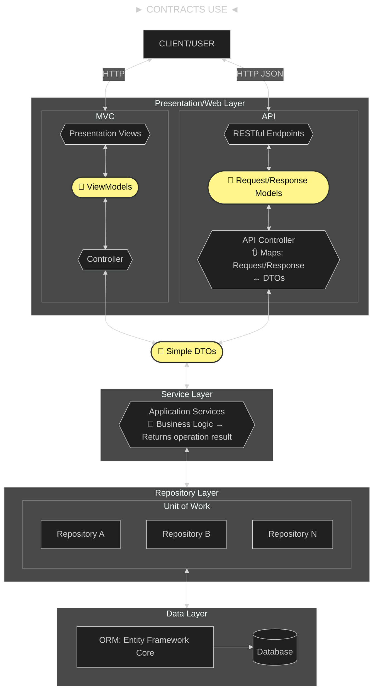
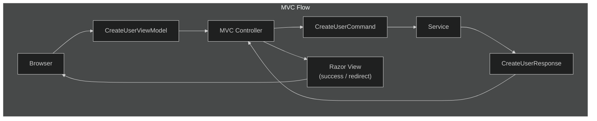
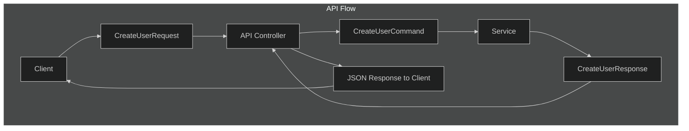

- [Architectural Design: Layer Boundaries and Contracts Between `Presentation` and `Service` Tiers - Example use: `UserCreate*`](#architectural-design-layer-boundaries-and-contracts-between-presentation-and-service-tiers---example-use-usercreate)
  - [What Contracts Are: Different types of DTOs](#what-contracts-are-different-types-of-dtos)
    - [Other Types of DTOs](#other-types-of-dtos)
  - [Where To Use Them Between Layers](#where-to-use-them-between-layers)
    - [Example: Contracts For N-Tier Project](#example-contracts-for-n-tier-project)
  - [Naming Conventions For Contracts](#naming-conventions-for-contracts)
    - [Example Naming Table](#example-naming-table)
    - [Example: `CreateUserRequest` vs `UserViewModel`](#example-createuserrequest-vs-userviewmodel)
  - [What CQRS Is And Where `CreateUserCommand` Fits](#what-cqrs-is-and-where-createusercommand-fits)
  - [How To Use `CreateUserCommand`](#how-to-use-createusercommand)
  - [Compare: `CreateUserRequest`, `CreateUserResponse`, `CreateUserCommand` and `CreateUserViewModel`](#compare-createuserrequest-createuserresponse-createusercommand-and-createuserviewmodel)
  - [Flow Diagram](#flow-diagram)
  - [Further Reading](#further-reading)

---

# Architectural Design: Layer Boundaries and Contracts Between `Presentation` and `Service` Tiers - Example use: `UserCreate*`

> Contracts define the _public surface_ of any layer.

---

## What Contracts Are: Different types of DTOs

- Contracts are the data shapes and message types that define layers talk to each other (API/MVC ↔ Application/Service), independently of the database or UI details.
- They are usually simple, serializable classes that carry input (commands/requests) and output (results/responses) for each use case, such as “CreateUser\*” (which is, for example, `CreateUserCommand`).
- In an N‑Tier or Clean Architecture, contract classes are often called _DTOs_ (Data Transfer Objects) or _messages_, and they live in a project that both the Web and Service layers can reference.
- Their main goal is to isolate the inner domain and persistence model from what the outer world (controllers, clients) see, so changes in entities or EF models do not break controllers or clients as long as the contract stays compatible.

Typical patterns to consider:

- **Command/Request**: everything needed to perform an operation (e.g., create/update a user).
- **Result/Response**: what the operation returns (data plus success/error info).
- **Common result wrapper**: a `Result` or `OperationResult` type that carries `IsSuccess`, `Errors`, etc., used by multiple operations.

### Other Types of DTOs

Lower number = closer to persistence, Higher number = closer to external consumers.

| Layer Proximity (DB → Client) | DTO Type                      | Changes State | Public Contract | Business-Semantic | Direction | Layer                       | Purpose                                         | Naming Focus                         |
| ----------------------------- | ----------------------------- | ------------- | --------------- | ----------------- | --------- | --------------------------- | ----------------------------------------------- | ------------------------------------ |
| 2 Application-core adjacent   | **Service DTO** (common DTOs) | ❌            | ❌              | ⚠️                | In / Out  | Application ↔ Application   | Internal data exchange between services/modules | Data-centric (`UserSummaryDto`)      |
| 3 Use-case layer              | **Command**                   | ✅            | ❌              | ✅                | Inbound   | Application / Service       | Express intent to perform a business action     | Verb + aggregate (`CreateUser`)      |
| 3 Use-case layer              | **Query DTO**                 | ❌            | ❌              | ✅                | Inbound   | Application / Read Model    | Express intent to retrieve data (no mutation)   | Question-based (`GetUserByIdQuery`)  |
| 3 Use-case layer              | **Result**                    | ❌            | ❌              | ✅                | Outbound  | Application / Service       | Represent outcome of a command/query            | Action outcome (`CreateUserResult`)  |
| 4 Presentation layer          | **ViewModel**                 | ❌            | ✅ (UI)         | ❌                | Outbound  | Presentation / UI           | Shape data for rendering and interaction        | Screen-focused (`UserEditViewModel`) |
| 5 Transport boundary          | **Request**                   | ✅ / ❌       | ✅              | ❌                | Inbound   | Transport (HTTP, Messaging) | Define inbound external contract                | API shape (`CreateUserRequest`)      |
| 5 Transport boundary          | **Response**                  | ❌            | ✅              | ❌                | Outbound  | Transport (HTTP, Messaging) | Define outbound external contract               | API shape (`CreateUserResponse`)     |

How to interpret **Layer Proximity**:

```terminal
1 → Database / ORM / Entities (not included)
2 → Application-core adjacent
3 → Use-case boundary
4 → Presentation
5 → External transport
```

Notes:

- **Domain entities** would be **Level 1**, but are intentionally _absent_ (they’re not DTOs)
- **Service DTOs** sit closest to domain without leaking persistence
- **Requests/Responses** are the farthest away and safest to evolve/version

Architectural invariant:

- Distance from the database **must increase** as you move outward
- Mapping always flows **upward**, never sideways or downward
- The farther from DB, the **less business knowledge** the object should carry

This proximity column is useful when validating layering during code reviews or enforcing boundaries with tests or analyzers.

Even though **Commands** and **Requests** may look similar structurally:

- **Commands** sit _closer to the domain_ and express **business intent**
- **Requests** sit _farther out_ and express **transport contracts**

---

## Where To Use Them Between Layers

- Controllers (API or MVC) should accept and return these contract classes, not domain entities.
- The controller maps incoming HTTP JSON into a contract (e.g., `CreateUserRequest`), passes it to an application/service method, and receives a contract back (e.g., `CreateUserResponse`).
- The service layer can then map between contracts and domain models internally using manual mapping or tools like AutoMapper.

### Example: Contracts For N-Tier Project

> This project follows an opinionated implementation of contracts.



---

## Naming Conventions For Contracts

There is no single mandatory standard, but common, clear conventions in .NET are:

- **Suffix by role** (highly recommended):
  - Requests into the system: `CreateUserRequest`, `UpdateUserRequest`, `RegistrationRequest`, etc.
  - Responses out of the system: `CreateUserResponse`, `RegistrationResult`, `RegistrationResponse`, etc.
  - Nested/child DTOs: `UserDto`, `AddressDto`, etc., when they are used inside those request/response types.
- **Verb + Entity + Suffix** for operations:
  - Commands: `CreateUserCommand`, `UpdateUserCommand`, `DeleteUserCommand`.
  - Queries: `GetUserQuery`, `ListUsersQuery`.
  - This pattern is popular when using CQRS/mediator libraries such as MediatR, where commands/queries are internal “messages”, and controller‑level contracts can still be named `CreateUserRequest/Response` if you want to keep external vs internal clear.

### Example Naming Table

| I/O    | Purpose                         | Suggested name                                 | Notes                                                        |
| ------ | ------------------------------- | ---------------------------------------------- | ------------------------------------------------------------ |
| Input  | API input to create user        | `CreateUserRequest`                            | Used in MVC/API action parameter.                            |
| Input  | Internal app command (optional) | `CreateUserCommand`                            | Input to command handler in service/CQRS layer.              |
| Output | API output after create         | `CreateUserResponse` or `CreateUserResult`     | Contains new `UserId`, maybe a summary DTO.                  |
| Input  | API input to register user      | `RegistrationRequest`                          | Similar to create user but maybe with extra fields.          |
| Output | API output for registration     | `RegistrationResult` or `RegistrationResponse` | Includes success flag, tokens, etc.                          |
| Both   | Reusable operation wrapper      | `Result` or `OperationResult<T>`               | Wraps success/error around commands and queries.             |
| Output | Nested user data                | `UserDto`                                      | Returned inside responses or query results; not UI-specific. |

Clean rule:

- Everything that crosses the Web boundary uses the `Request`/`Response`/`Result` suffix; everything that is a CQRS message inside the application uses `Command`/`Query`.
- Keep these contract types in a `Contracts` (or `Application.Contracts`) project/folder, separate from `Domain` and `Persistence`, and avoid putting EF or business logic inside them.

### Example: `CreateUserRequest` vs `UserViewModel`

- `CreateUserRequest`: DTO/contract used at the API boundary to represent the HTTP payload for creating a user (what the client sends into the API method). It should contain only what is needed to perform the create operation and be stable over time as part of your public API.
- `UserViewModel`: A model tailored for rendering views (e.g., MVC Razor) or UI state, often combining multiple pieces of data or UI-specific fields like select‑list items, labels, or validation metadata.
- In APIs you often don’t need a ViewModel; you keep a `CreateUserRequest` contract and a `UserDto` for outputs.
- In MVC with Razor, you might map between `UserViewModel` (for the view) and `CreateUserRequest` or a domain model in the controller.

---

## What CQRS Is And Where `CreateUserCommand` Fits

- **CQRS (Command Query Responsibility Segregation)** is a pattern where operations that change state (commands: create/update/delete) are separated from those that read state (queries: get/list/search).
- A **command** object like `CreateUserCommand` represents the intent to change the system (e.g., “create this user with these properties”) and is handled by a command handler in the application layer.
- In a typical flow: controller receives `CreateUserRequest` → maps it to `CreateUserCommand` → sends it to a command handler → handler runs business logic and persistence → returns a `Result`/`CreateUserResponse`.

---

## How To Use `CreateUserCommand`

- Keep `CreateUserCommand` inside the application/service layer, not directly exposed to the outside world.
- Map from external contract to command:
  - API/MVC layer: `CreateUserRequest` → `CreateUserCommand`.
  - Application layer: command handler executes, then returns `Result` plus any output DTO (`CreateUserResponse`).
- Commands should be focused on writes: they should not return big read models; usually they return only success/failure and identifiers or small summaries.

---

## Compare: `CreateUserRequest`, `CreateUserResponse`, `CreateUserCommand` and `CreateUserViewModel`

> Consider including `CreateUserResult`

| Aspect                 | `CreateUserRequest`                                                            | `CreateUserResponse`                                        | `CreateUserCommand`                                                           | `CreateUserViewModel`                                     |
| ---------------------- | ------------------------------------------------------------------------------ | ----------------------------------------------------------- | ----------------------------------------------------------------------------- | --------------------------------------------------------- |
| **Layer**              | API/Presentation Layer                                                         | Service/Application Layer                                   | Service/Application Layer                                                     | MVC/Presentation Layer                                    |
| **Purpose**            | Receive data from HTTP client                                                  | Return result of creation operation                         | Trigger business logic operation                                              | Bind form data, display to view                           |
| **Validation**         | Data annotations, model binding                                                | N/A (output only)                                           | Business rules validation                                                     | Data annotations, model binding, UI-specific validation   |
| **Coupling**           | Coupled to web framework (ASP\.NET)                                            | Framework-agnostic                                          | Framework-agnostic                                                            | Coupled to MVC framework (ASP\.NET MVC)                   |
| **Changes when**       | API contract changes                                                           | What clients need to know about creation changes            | Business requirements change                                                  | UI/UX requirements change                                 |
| **Example attributes** | `[Required]`, `[EmailAddress]`, `[FromBody]`                                   | Clean, no framework attributes                              | Clean, no framework attributes                                                | `[Required]`, `[Display]`, `[Compare]`, `SelectList`      |
| **Used by**            | API Controllers/Endpoints                                                      | Returned to Controllers (both MVC and API)                  | Service layer methods                                                         | MVC Controllers and Razor Views                           |
| **Used with**          | `[FromBody] CreateUserRequest`                                                 | `return Ok(response)` or `return View("Success", response)` | Passed to service methods like `CreateUserAsync(CreateUserCommand command)`   | `@model CreateUserViewModel` in Razor                     |
| **Data flow**          | HTTP Client → CreateUserRequest → API Controller → CreateUserCommand → Service | Service → CreateUserResponse → Controller → Client/View     | Browser Form → CreateUserViewModel → Controller → CreateUserCommand → Service | Browser Form ↔ Controller ↔ View                          |
| **Content**            | Pure data fields needed for creation                                           | Minimal result data (UserId, UserName, Email, CreatedAt)    | Pure data fields needed for business operation                                | Display logic, validation for UI, dropdown lists, helpers |

**In practice:** Your controller maps `CreateUserRequest` → `CreateUserCommand`, keeping layers decoupled.

**NOTES:**

- You should use `CreateUserCommand` between MVC layer and service layer.
- MVC/API layer translates it to `CreateUserCommand`
- Service layer only knows about `CreateUserCommand`
- Service layer stays decoupled from web concerns

## Flow Diagram





> **IMPORTANT NOTE**: For this project, the `*Command` and `*Query` parts are omitted, and instead, only DTOs are used.

---

## Further Reading

- [CQRS Example](cqrs-example.md)
