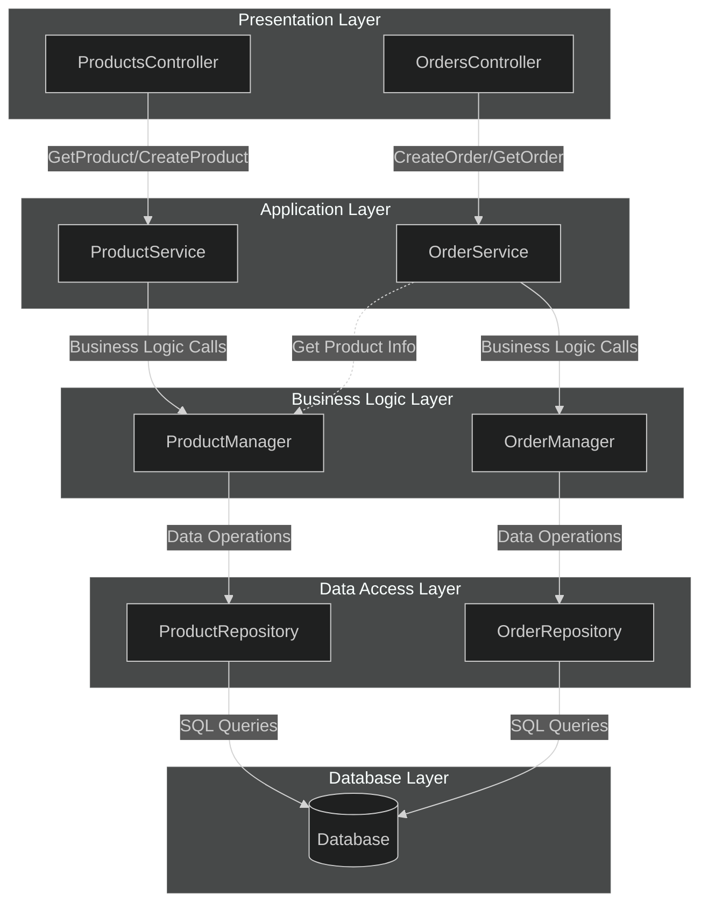

- [Layered (N-Tier) Architecture in .NET Core](#layered-n-tier-architecture-in-net-core)
  - [Overview](#overview)
  - [1. Presentation Layer (API Controllers)](#1-presentation-layer-api-controllers)
    - [Products Controller](#products-controller)
    - [Orders Controller](#orders-controller)
  - [2. Application Layer (Services)](#2-application-layer-services)
    - [Product Service](#product-service)
    - [Order Service](#order-service)
  - [3. Business Logic Layer (Managers)](#3-business-logic-layer-managers)
    - [Product Manager](#product-manager)
    - [Order Manager](#order-manager)
  - [4. Data Access Layer (Repositories)](#4-data-access-layer-repositories)
    - [Product Repository](#product-repository)
    - [Order Repository](#order-repository)
  - [5. Dependency Injection Configuration](#5-dependency-injection-configuration)
    - [Startup.cs](#startupcs)
  - [Key Benefits](#key-benefits)
    - [Drawbacks](#drawbacks)
    - [Compared To Other Architectures](#compared-to-other-architectures)
      - [Table 1: Most Important Attributes](#table-1-most-important-attributes)
      - [Table 2: Less Important Attributes](#table-2-less-important-attributes)
  - [Layer Flow](#layer-flow)
- [N-Tier Example Diagram](#n-tier-example-diagram)

---

# Layered (N-Tier) Architecture in .NET Core

**NOTE**: There is more than one way of implementing this architecture. This is just one of many examples

## Overview

Layered Architecture divides an application into logical layers with specific responsibilities:

| Level | Layer                          | Responsibility                               | Examples               |
| ----- | ------------------------------ | -------------------------------------------- | ---------------------- |
| 5     | **Presentation Layer**         | Handles user/API requests and responses      | Web API, MVC, Angular  |
| 4     | **Application Layer**          | Coordinates use cases and orchestrates logic | Services, Use Cases    |
| 3     | **Business Logic Layer (BLL)** | Enforces rules and domain behaviors          | Managers, Domain Logic |
| 2     | **Data Access Layer (DAL)**    | Provides persistence operations              | Repositories, EF Core  |
| 1     | **Database Layer**             | Physical data storage                        | SQL Server, PostgreSQL |

1 is innermost.

---

## 1. Presentation Layer (API Controllers)

- The Presentation Layer is responsible for handling user interactions. In our case, this is a Web API that exposes endpoints for managing products and orders.
- Here, it is reduced to a RESTful API, but I could also be an MVC or Angular project.

### Products Controller

```csharp
using Microsoft.AspNetCore.Mvc;
using ProductOrder.Application.Interfaces;
using ProductOrder.Application.DTOs;

namespace ProductOrder.Api.Controllers
{
    [Route("api/[controller]")]
    [ApiController]
    public class ProductsController : ControllerBase
    {
        private readonly IProductService _productService;

        public ProductsController(IProductService productService)
        {
            _productService = productService;
        }

        [HttpGet("{id}")]
        public async Task<IActionResult> GetProduct(Guid id)
        {
            ProductDto product = await _productService.GetProductByIdAsync(id);
            if (product == null) return NotFound();
            return Ok(product);
        }

        [HttpPost]
        public async Task<IActionResult> CreateProduct([FromBody] ProductDto productDto)
        {
            ProductDto product = await _productService.AddProductAsync(productDto);
            return CreatedAtAction(nameof(GetProduct), new { id = product.Id }, product);
        }
    }
}
```

### Orders Controller

```csharp
[Route("api/[controller]")]
[ApiController]
public class OrdersController : ControllerBase
{
    private readonly IOrderService _orderService;

    public OrdersController(IOrderService orderService)
    {
        _orderService = orderService;
    }

    [HttpPost]
    public async Task<IActionResult> CreateOrder(Guid productId, int quantity)
    {
        OrderDto order = await _orderService.CreateOrderAsync(productId, quantity);
        return CreatedAtAction(nameof(GetOrder), new { id = order.Id }, order);
    }

    [HttpGet("{id}")]
    public async Task<IActionResult> GetOrder(Guid id)
    {
        OrderDto order = await _orderService.GetOrderByIdAsync(id);
        if (order == null) return NotFound();
        return Ok(order);
    }
}
```

---

## 2. Application Layer (Services)

The Application Layer manages the workflows of the application. It handles the orchestration of business logic and data access.

### Product Service

```csharp
using ProductOrder.Application.Interfaces;
using ProductOrder.Application.DTOs;
using ProductOrder.BLL.Interfaces;

namespace ProductOrder.Application.Services
{
    public class ProductService : IProductService
    {
        private readonly IProductManager _productManager;

        public ProductService(IProductManager productManager)
        {
            _productManager = productManager;
        }

        public async Task<ProductDto> GetProductByIdAsync(Guid id)
        {
            Product product = await _productManager.GetByIdAsync(id);
            return new ProductDto
            {
                Id = product.Id,
                Name = product.Name,
                Price = product.Price
            };
        }

        public async Task<ProductDto> AddProductAsync(ProductDto productDto)
        {
            Product product = new Product
            {
                Name = productDto.Name,
                Price = productDto.Price
            };

            await _productManager.AddAsync(product);

            return new ProductDto
            {
                Id = product.Id,
                Name = product.Name,
                Price = product.Price
            };
        }
    }
}
```

### Order Service

```csharp
public class OrderService : IOrderService
{
    private readonly IOrderManager _orderManager;
    private readonly IProductManager _productManager;

    public OrderService(IOrderManager orderManager, IProductManager productManager)
    {
        _orderManager = orderManager;
        _productManager = productManager;
    }

    public async Task<OrderDto> CreateOrderAsync(Guid productId, int quantity)
    {
        Product product = await _productManager.GetByIdAsync(productId);
        if (product == null) throw new Exception("Product not found");

        Order order = new Order
        {
            ProductId = productId,
            Quantity = quantity,
            OrderDate = DateTime.UtcNow,
            Product = product
        };

        await _orderManager.AddAsync(order);

        return new OrderDto
        {
            Id = order.Id,
            ProductId = order.ProductId,
            Quantity = order.Quantity,
            Total = order.Total,
            OrderDate = order.OrderDate
        };
    }
}
```

---

## 3. Business Logic Layer (Managers)

The Business Logic Layer (BLL) contains the core business rules and logic. It focuses on the problem domain and implements the business rules without worrying about how data is stored or presented.

### Product Manager

```csharp
using ProductOrder.BLL.Interfaces;
using ProductOrder.DAL.Interfaces;
using ProductOrder.Domain.Entities;

namespace ProductOrder.BLL.Managers
{
    public class ProductManager : IProductManager
    {
        private readonly IProductRepository _productRepository;

        public ProductManager(IProductRepository productRepository)
        {
            _productRepository = productRepository;
        }

        public async Task<Product> GetByIdAsync(Guid id)
        {
            return await _productRepository.GetByIdAsync(id);
        }

        public async Task AddAsync(Product product)
        {
            await _productRepository.AddAsync(product);
        }
    }
}
```

### Order Manager

```csharp
public class OrderManager : IOrderManager
{
    private readonly IOrderRepository _orderRepository;

    public OrderManager(IOrderRepository orderRepository)
    {
        _orderRepository = orderRepository;
    }

    public async Task<Order> GetByIdAsync(Guid id)
    {
        return await _orderRepository.GetByIdAsync(id);
    }

    public async Task AddAsync(Order order)
    {
        await _orderRepository.AddAsync(order);
    }
}
```

---

## 4. Data Access Layer (Repositories)

The Data Access Layer (DAL) is responsible for interacting with the database. It contains repository classes that encapsulate the logic for retrieving and storing data.

### Product Repository

```csharp
using Microsoft.EntityFrameworkCore;
using ProductOrder.Domain.Entities;
using ProductOrder.DAL.Interfaces;

namespace ProductOrder.DAL.Repositories
{
    public class ProductRepository : IProductRepository
    {
        private readonly ApplicationDbContext _context;

        public ProductRepository(ApplicationDbContext context)
        {
            _context = context;
        }

        public async Task<Product> GetByIdAsync(Guid id)
        {
            return await _context.Products.FindAsync(id);
        }

        public async Task<IEnumerable<Product>> GetAllAsync()
        {
            return await _context.Products.ToListAsync();
        }

        public async Task AddAsync(Product product)
        {
            await _context.Products.AddAsync(product);
            await _context.SaveChangesAsync();
        }

        public async Task UpdateAsync(Product product)
        {
            _context.Products.Update(product);
            await _context.SaveChangesAsync();
        }

        public async Task DeleteAsync(Guid id)
        {
            Product product = await GetByIdAsync(id);
            if (product != null)
            {
                _context.Products.Remove(product);
                await _context.SaveChangesAsync();
            }
        }
    }
}
```

### Order Repository

```csharp
public class OrderRepository : IOrderRepository
{
    private readonly ApplicationDbContext _context;

    public OrderRepository(ApplicationDbContext context)
    {
        _context = context;
    }

    public async Task<Order> GetByIdAsync(Guid id)
    {
        return await _context.Orders
            .Include(o => o.Product)
            .FirstOrDefaultAsync(o => o.Id == id);
    }

    public async Task<IEnumerable<Order>> GetAllAsync()
    {
        return await _context.Orders
            .Include(o => o.Product)
            .ToListAsync();
    }

    public async Task AddAsync(Order order)
    {
        await _context.Orders.AddAsync(order);
        await _context.SaveChangesAsync();
    }

    public async Task UpdateAsync(Order order)
    {
        _context.Orders.Update(order);
        await _context.SaveChangesAsync();
    }

    public async Task DeleteAsync(Guid id)
    {
        Order order = await GetByIdAsync(id);
        if (order != null)
        {
            _context.Orders.Remove(order);
            await _context.SaveChangesAsync();
        }
    }
}
```

---

## 5. Dependency Injection Configuration

Configure the dependency injection and set up the middleware pipeline in the `Startup.cs` file.

### Startup.cs

```csharp
public class Startup
{
    public void ConfigureServices(IServiceCollection services)
    {
        // Database Context
        services.AddDbContext<ApplicationDbContext>(options =>
            options.UseSqlServer(Configuration.GetConnectionString("DefaultConnection")));

        // Repositories (DAL)
        services.AddScoped<IProductRepository, ProductRepository>();
        services.AddScoped<IOrderRepository, OrderRepository>();

        // Managers (BLL)
        services.AddScoped<IProductManager, ProductManager>();
        services.AddScoped<IOrderManager, OrderManager>();

        // Services (Application Layer)
        services.AddScoped<IProductService, ProductService>();
        services.AddScoped<IOrderService, OrderService>();

        // Controllers
        services.AddControllers();
    }

    public void Configure(IApplicationBuilder app, IWebHostEnvironment env)
    {
        if (env.IsDevelopment())
        {
            app.UseDeveloperExceptionPage();
        }

        app.UseRouting();
        app.UseEndpoints(endpoints =>
        {
            endpoints.MapControllers();
        });
    }
}
```

---

## Key Benefits

1. **Separation of Concerns** — Each layer has a focused responsibility.
2. **Maintainability** — Layer boundaries help isolate changes.
3. **Testability** — Each layer can be tested independently, especially services/managers.
4. **Scalability**
   - _Scales well in complexity_ (structure remains predictable).
   - _Does NOT scale well for large teams_ (layer bottlenecks).
5. **Clear Dependencies** — Layers interact in a predictable top-to-bottom flow.

### Drawbacks

1. **Cross-Layer Coupling**: Changes ripple across multiple layers
2. **Poor Feature Modularity**: Feature code is scattered through separate layers
3. **Excessive Boilerplate**: Requires repetitive DTO → Service → Manager → Repository flows
4. **Team Bottlenecks**: Many developers touch the same layers, creating conflicts
5. **Anemic Domain Risk**: Business rules leak into services instead of domain entities
6. **Layer Violations Over Time**: Pressure leads teams to bypass proper boundaries
7. **Weak Business Alignment**: Technical layer names don’t reflect domain meaning
8. **Limited Suitability for Complex Domains**: Rigid layering struggles with rich business rules

### Compared To Other Architectures

Project examples:

- nTier: <https://github.com/carloswm85/basic-ntier-template>
- DDD: ???
- Vertical Slice: ???
- Clear Architecture: <https://github.com/jasontaylordev/CleanArchitecture>

#### Table 1: Most Important Attributes

| Nº  | Attribute               | **N-Tier (Layered)**                           | **DDD (Domain-Driven Design)**                 | **Vertical Slice Architecture**                      | **Clean Architecture**                                          |
| --- | ----------------------- | ---------------------------------------------- | ---------------------------------------------- | ---------------------------------------------------- | --------------------------------------------------------------- |
| 1   | **Primary Goal**        | Separation of responsibilities                 | Model the domain deeply                        | Feature-based isolation                              | Independence from frameworks & UI                               |
| 2   | **Organization**        | By layers (UI → App → BLL → DAL)               | By domain concepts (Aggregates, Value Objects) | By features (CreateOrder, GetOrder…)                 | By concentric circles (Entities, Use Cases, Interface Adapters) |
| 3   | **Coupling**            | Higher coupling between layers                 | Low coupling, domain is pure                   | Very low, slices decouple features                   | Very low, strict rule of stable core                            |
| 4   | **Scalability (Teams)** | Harder to scale: teams compete for same layers | Good for large domains                         | Excellent: teams work per slice                      | Good: clear responsibilities                                    |
| 5   | **Testability**         | Medium                                         | High (pure domain, no infra dependencies)      | Very high (isolated slices)                          | Very high (dependency rule)                                     |
| 6   | **Learning Curve**      | Low                                            | High                                           | Low–Medium                                           | Medium                                                          |
| 7   | **Best Use Cases**      | CRUD apps, simple business logic               | Complex business domains                       | APIs with many independent use cases                 | Systems needing long-term maintainability                       |
| 8   | **Typical Pain Points** | Cross-layer leakage, boilerplate               | High upfront modeling cost                     | Many files for small features                        | Verbose structure and folder depth                              |
| 9   | **When to Choose**      | You want simplicity and familiarity            | Your business has rich domain rules            | Fast development per feature, microservices-friendly | Strong boundaries, longevity, framework independence            |

#### Table 2: Less Important Attributes

| Nº  | Attribute                           | **N-Tier (Layered)**                                 | **DDD (Domain-Driven Design)**             | **Vertical Slice Architecture**                  | **Clean Architecture**                              |
| --- | ----------------------------------- | ---------------------------------------------------- | ------------------------------------------ | ------------------------------------------------ | --------------------------------------------------- |
| 10  | **Change Impact**                   | High — changes ripple across layers                  | Low — changes isolated to domain elements  | Very low — change stays inside the slice         | Low — affects only one circle                       |
| 11  | **Domain Complexity Handling**      | Weak — domain tends to be anemic                     | Excellent — designed for this              | Moderate — depends on slice design               | Strong — domain/use cases are central               |
| 12  | **Feature Traceability**            | Low — feature logic scattered across layers          | Medium — distributed by domain concepts    | Excellent — all feature code is colocated        | Good — use cases are grouped meaningfully           |
| 13  | **Folder Structure Depth**          | Shallow but broad                                    | Deep, domain-centric                       | Very shallow — simple slice folders              | Medium to deep (Entities → UseCases → Adapters)     |
| 14  | **Framework Dependence**            | High — Presentation and DAL often tied to frameworks | Low — domain is pure                       | Low — slices can be framework-light              | Very low — architectural rule enforces independence |
| 15  | **Evolution Over Time**             | Degrades — tends to accumulate coupling              | Strong — evolves with domain growth        | Very strong — slices remain isolated             | Strong — architecture remains stable                |
| 16  | **Onboarding Speed**                | Fast                                                 | Slow initially                             | Fast                                             | Medium                                              |
| 17  | **Complexity Management**           | Weak — complexity spreads across layers              | Strong — domain model controls complexity  | Very strong — slices prevent cross-contamination | Strong — boundaries prevent tangling                |
| 18  | **Testing Focus**                   | Service & Manager layers                             | Domain Services, Aggregates, Value Objects | Per-slice handlers                               | Use Cases, domain entities                          |
| 19  | **Performance Considerations**      | Some overhead from multiple layers                   | Very efficient domain core                 | Efficient — minimal indirection                  | Efficient — clean separation but some overhead      |
| 20  | **Code Ownership Model**            | Layer ownership (UI team, BLL team, etc.)            | Domain ownership                           | Slice ownership (feature teams)                  | Boundary ownership (domain, use cases, adapters)    |
| 21  | **Fit for Microservices**           | Weak — layers don’t align with service boundaries    | Good — domain-driven decomposition         | Excellent — slices map easily to services        | Good — clear boundaries help extraction             |
| 22  | **Cross-Cutting Concerns Handling** | Spread across layers                                 | Centralized domain events/policies         | Per slice or middleware                          | Adapters and middleware handle it cleanly           |
| 23  | **Refactoring Cost**                | High — many layers need updates                      | Medium — domain refactoring is planned     | Very low — you refactor only the slice           | Medium — boundaries keep changes controlled         |
| 24  | **Implementation Speed**            | Fast for simple CRUD                                 | Slow at first, fast later                  | Very fast per feature                            | Medium — requires discipline                        |

---

## Layer Flow

```terminal
User Request → API Controller (Presentation)
    ↓
Service (Application Layer)
    ↓
Manager (Business Logic)
    ↓
Repository (Data Access)
    ↓
Database
```

---

# N-Tier Example Diagram


