- [Authorization](#authorization)
	- [Key Concepts Now Shown](#key-concepts-now-shown)
	- [Key Relationships Highlighted](#key-relationships-highlighted)
	- [Additional Explanation](#additional-explanation)
		- [1) Claims are the foundation](#1-claims-are-the-foundation)
			- [Readings: Claims](#readings-claims)
		- [2) Roles are a specialization of claims](#2-roles-are-a-specialization-of-claims)
		- [3) Policies are rules that evaluate claims](#3-policies-are-rules-that-evaluate-claims)
		- [A) Mental model (important)](#a-mental-model-important)
		- [B) Practical guidance](#b-practical-guidance)
- [Admin User Complete Lifecycle Flow](#admin-user-complete-lifecycle-flow)
	- [What the Diagram Shows](#what-the-diagram-shows)
	- [Differences Between Admin And Regular Users Side By Side](#differences-between-admin-and-regular-users-side-by-side)
		- [Key Differences Highlighted](#key-differences-highlighted)
		- [Important Authorization Patterns Shown](#important-authorization-patterns-shown)
- [Full Example - Identity API: Pet Shop](#full-example---identity-api-pet-shop)
	- [What's Included](#whats-included)
	- [Why This is Forward-Thinking](#why-this-is-forward-thinking)
	- [Code: 🏪 PET SHOP AUTHORIZATION - POLICY-BASED DESIGN (Modern ASP.NET Core)](#code--pet-shop-authorization---policy-based-design-modern-aspnet-core)
		- [1️⃣ DOMAIN MODELS](#1️⃣-domain-models)
		- [2️⃣ AUTHORIZATION REQUIREMENTS (Business Rules)](#2️⃣-authorization-requirements-business-rules)
		- [3️⃣ AUTHORIZATION HANDLERS (Business Logic)](#3️⃣-authorization-handlers-business-logic)
		- [4️⃣ PROGRAM.CS - POLICY REGISTRATION (Modern approach)](#4️⃣-programcs---policy-registration-modern-approach)
		- [5️⃣ CONTROLLER - POLICY USAGE](#5️⃣-controller---policy-usage)
		- [6️⃣ USAGE EXAMPLES \& SCENARIOS](#6️⃣-usage-examples--scenarios)
		- [✨ BENEFITS OF THIS MODERN APPROACH](#-benefits-of-this-modern-approach)
		- [🚀 FORWARD-THINKING: Future Enhancements](#-forward-thinking-future-enhancements)

---

# Authorization

```mermaid
---
config:
 theme: dark
 look: handDrawn
 layout: elk
---
flowchart TB
    User([👤 User])

    subgraph ClaimsBox["🎫 CLAIMS = Key-Value Pairs"]
        direction TB
        ClaimDef["<b>Claim:</b> A statement about a user<br/><small>Examples: name='John', email='john@example.com'<br/>role='Admin', department='Engineering'</small>"]
        ClaimTypes["Common Claim Types:<br/><small>ClaimTypes.Name, ClaimTypes.Email<br/>ClaimTypes.Role, Custom claims</small>"]
    end

    User ==> ClaimsBox

    subgraph Auth["🔐 ASP\.NET Core Authorization Pipeline"]
        direction TB
        Entry[Authorization Middleware]

        subgraph RoleBox["📋 ROLE-BASED (Simple)"]
            RoleDef["<b>Role:</b> A claim with type 'role'<br/><small>Special claim used for grouping</small>"]
            RoleAuth["[Authorize(Roles='Admin,Manager')]<br/><small>Checks if user has role claim</small>"]
            RoleDef --> RoleAuth
        end

        subgraph PolicyBox["⚙️ POLICY-BASED (Flexible)"]
            PolicyDef["<b>Policy:</b> Named authorization rules<br/><small>Can check multiple claims, roles,<br/>custom logic, resource context</small>"]
            PolicyAuth["[Authorize(Policy='MinAge21')]<br/><small>Evaluates complex requirements</small>"]
            PolicyDef --> PolicyAuth
        end

        subgraph PolicyEngine["Policy Evaluation Engine"]
            direction LR
            Requirements["📜 Requirements<br/><small>IAuthorizationRequirement</small><br/>Rules to satisfy"]
            Handlers["🔧 Handlers<br/><small>AuthorizationHandler&lt;T&gt;</small><br/>Logic to evaluate rules"]
            Requirements -.implements.-> Handlers
        end
    end

    ClaimsBox ==>|provides| Entry
    Entry --> RoleBox
    Entry --> PolicyBox

    RoleBox -.role is just<br/>a special claim.-> ClaimsBox
    PolicyBox ==>|uses| Requirements
    PolicyBox -.can also check<br/>roles & claims.-> ClaimsBox

    Handlers ==>|Evaluate| Decision{✓ Access<br/>Granted?}

    Decision ==>|✅ Success| Resource["🎯 Protected Resource<br/><small>Controller/Action</small>"]
    Decision ==>|❌ Fail| Denied["🚫 Access Denied<br/><small>403 Forbidden</small>"]

    Resource -.resource context.-> Handlers

    style User fill:#1e40af,stroke:#3b82f6,color:#fff
    style ClaimsBox fill:#7c3aed,stroke:#a78bfa,color:#fff
    style RoleBox fill:#0891b2,stroke:#06b6d4,color:#fff
    style PolicyBox fill:#c026d3,stroke:#d946ef,color:#fff
    style Auth fill:#1e293b,stroke:#475569,color:#cbd5e1
    style PolicyEngine fill:#0f172a,stroke:#334155,color:#94a3b8
    style Decision fill:#ea580c,stroke:#fb923c,color:#fff
    style Resource fill:#059669,stroke:#34d399,color:#fff
    style Denied fill:#dc2626,stroke:#f87171,color:#fff
```



## Key Concepts Now Shown

**🎫 CLAIM (Foundation)**

- A key-value pair statement about a user (e.g., `name="John"`, `email="john@example.com"`, `department="Engineering"`)
- The fundamental building block of identity in ASP\.NET Core
- Can be anything: name, email, age, department, custom properties

**📋 ROLE (Simple Authorization)**

- A **special type of claim** with type `ClaimTypes.Role`
- Used for grouping users (Admin, Manager, User, etc.)
- Shown with a dotted line back to Claims to emphasize that "a role is just a special claim"
- Simple to use: `[Authorize(Roles="Admin")]`

**⚙️ POLICY (Flexible Authorization)**

- Named authorization rules that can check multiple conditions
- Can evaluate roles, claims, custom logic, and resource context
- More powerful and flexible than role-based authorization
- Example: A "MinAge21" policy can check a birthdate claim and calculate age
- Shown with a dotted line to Claims to show policies can check any claim, including roles

--

## Key Relationships Highlighted

1. **Roles ARE Claims** - A role is just a claim with a special type
2. **Policies use Claims** - Policies can check any claim (including roles)
3. **Policies are more flexible** - While roles are binary (you have it or you don't), policies can implement complex business logic

This makes it clear that:

- Claims are the foundation,
- Roles are a convenience layer, and
- Policies are the most flexible option for complex authorization scenarios.

---

## Additional Explanation

**Short answer**
👉 **Claims come first**, then **Roles**, and finally **Policies**.

- **Claims** are the **raw facts**
- **Roles** are **standardized claims**
- **Policies** are **logic containers that evaluate claims**
- **Authorization in ASP.NET Core never bypasses claims**

Everything funnels through claims — policies just **coordinate how they’re evaluated**.

### 1) Claims are the foundation

- The **atomic unit** of identity and authorization.
- Everything starts as a claim: `type + value`.
- Examples: `email`, `department`, `age`, `permission`, `role`.
- ASP\.NET Core authorization ultimately evaluates **claims**, not users or roles directly.

> - If there are no claims, nothing else can be evaluated.
> - No authorization can then be provided.

- ASP.NET Core authorization always evaluates claims.
- Even when you use roles, the framework checks role claims.
- Policies, role checks, and custom handlers all resolve to:
  > Does the user principal contain the required claims?

#### Readings: Claims

- <https://learn.microsoft.com/en-us/windows-server/identity/ad-fs/technical-reference/the-role-of-claims>

---

### 2) Roles are a specialization of claims

- A **role is just a claim** with type `ClaimTypes.Role`.
- Roles exist for **convenience and readability**, not extra power.
- Internally, `[Authorize(Roles = "Admin")]` becomes:

> “Does the user have a role claim with value `Admin`?”

So conceptually:

```powershell
# Every role is a type of claim
# Role is a proper subset of claim
Role ⊂ Claim
```

---

### 3) Policies are rules that evaluate claims

- Policies are **authorization logic containers**.
- They **consume claims** (including role claims).
- Policies can:

  - Check multiple claims
  - Combine claims + roles
  - Execute custom code
  - Evaluate resources (resource-based authorization)

Policies don’t replace claims or roles — they **orchestrate them**.

### A) Mental model (important)

```terminal
CLAIMS  →	 ROLES (special claims)  →  POLICIES (logic over claims)
```

Or phrased differently:

- **Claims** answer: _What is true about the user?_
- **Roles** answer: _Which group does the user belong to?_
- **Policies** answer: _Is the user allowed to do this, under these conditions?_

### B) Practical guidance

- Use **claims** for expressing facts and permissions.
- Use **roles** only for **coarse-grained grouping**.
- Use **policies** for anything non-trivial or business-related.
- Forward-thinking design in modern ASP\.NET Core favors **policy-based authorization**, even when roles are involved.

This is why Microsoft’s docs and newer APIs consistently push **policies as the top-level authorization abstraction**, with claims underneath.

---

# Admin User Complete Lifecycle Flow

**Sequence diagram** showing the complete lifecycle of an admin user from login to logout, including all CRUD operations. This format is perfect for showing the temporal flow and interactions between components.

## What the Diagram Shows

**🔵 Authentication Phase (Steps 1-6)**

- User enters credentials
- System validates and creates claims (including "Admin" role)
- Token/cookie is generated and sent to user

**🟣 CREATE - POST (Steps 7-15)**

- User sends authenticated request to create a resource
- Token is validated and claims are extracted
- Authorization checks the "Admin" role
- New product is created in database

**🟢 READ - GET (Steps 16-23)**

- User retrieves the created resource
- Same auth flow: token validation → authorization check → database query

**🟠 UPDATE - PUT (Steps 24-32)**

- User modifies the resource
- Shows policy-based authorization (more complex than role check)
- Database is updated

**🔴 DELETE - DELETE (Steps 33-40)**

- User removes the resource
- Role-based authorization (Admin only)
- Database record deleted

**⚫ Logout Phase (Steps 41-46)**

- User initiates logout
- Token/session is invalidated
- Refresh tokens are revoked
- User is redirected to login

Each phase is color-coded and clearly numbered, showing the exact sequence of operations, requests, responses, and authorization checks throughout the entire user session.

```mermaid
---
config:
 theme: dark
 look: handDrawn
---
sequenceDiagram
	autonumber
	actor Admin as 👤 Admin User
	participant Login as 🔐 Login Page
	participant Auth as 🎫 Authentication Service
	participant Token as 🪙 Token/Cookie Handler
	participant API as 🌐 API/Controller
	participant AuthZ as ✅ Authorization Middleware
	participant DB as 💾 Database
	participant Logout as 🚪 Logout Handler

	rect rgb(30, 64, 175)
	Note over Admin,Token: 🔵 AUTHENTICATION PHASE: Login
	Admin->>Login: 1. Enter credentials<br/>(username + password)
	Login->>Auth: 2. Validate credentials
	Auth->>DB: 3. Query user + claims
	DB-->>Auth: 4. User found<br/>Claims: {role: "Admin", email: "admin@app.com"}
	Auth->>Token: 5. Generate JWT/Cookie
	Token-->>Admin: 6. Set authentication token<br/>(HttpOnly cookie or Bearer token)
	Note over Admin: ✓ User authenticated<br/>Identity established
	end

	rect rgb(192, 38, 211)
	Note over Admin,DB: 🟣 CREATE OPERATION
	Admin->>API: 7. POST /api/products<br/>Authorization: Bearer {token}
	API->>Token: 8. Validate token
	Token-->>API: 9. Token valid<br/>Extract ClaimsPrincipal
	API->>AuthZ: 10. Check authorization<br/>[Authorize(Roles="Admin")]
	AuthZ->>AuthZ: 11. Verify "Admin" claim exists
	AuthZ-->>API: 12. ✅ Authorized
	API->>DB: 13. INSERT INTO products
	DB-->>API: 14. Product created (ID: 42)
	API-->>Admin: 15. 201 Created<br/>{id: 42, name: "Widget"}
	end

	rect rgb(5, 150, 105)
	Note over Admin,DB: 🟢 READ OPERATION
	Admin->>API: 16. GET /api/products/42<br/>Authorization: Bearer {token}
	API->>Token: 17. Validate token
	Token-->>API: 18. Token valid
	API->>AuthZ: 19. Check authorization
	AuthZ-->>API: 20. ✅ Authorized
	API->>DB: 21. SELECT * FROM products WHERE id=42
	DB-->>API: 22. Product data
	API-->>Admin: 23. 200 OK<br/>{id: 42, name: "Widget", price: 99.99}
	end

	rect rgb(234, 88, 12)
	Note over Admin,DB: 🟠 UPDATE OPERATION
	Admin->>API: 24. PUT /api/products/42<br/>Authorization: Bearer {token}
	API->>Token: 25. Validate token
	Token-->>API: 26. Token valid
	API->>AuthZ: 27. Check authorization<br/>[Authorize(Policy="CanEditProducts")]
	AuthZ->>AuthZ: 28. Evaluate policy requirements
	AuthZ-->>API: 29. ✅ Authorized
	API->>DB: 30. UPDATE products SET... WHERE id=42
	DB-->>API: 31. Product updated
	API-->>Admin: 32. 200 OK<br/>{id: 42, name: "Super Widget"}
	end

	rect rgb(220, 38, 38)
	Note over Admin,DB: 🔴 DELETE OPERATION
	Admin->>API: 33. DELETE /api/products/42<br/>Authorization: Bearer {token}
	API->>Token: 34. Validate token
	Token-->>API: 35. Token valid
	API->>AuthZ: 36. Check authorization<br/>[Authorize(Roles="Admin")]
	AuthZ-->>API: 37. ✅ Authorized
	API->>DB: 38. DELETE FROM products WHERE id=42
	DB-->>API: 39. Product deleted
	API-->>Admin: 40. 204 No Content
	end

	rect rgb(71, 85, 105)
	Note over Admin,Logout: ⚫ LOGOUT PHASE
	Admin->>Logout: 41. Click logout button
	Logout->>Token: 42. Invalidate token/session
	Token->>DB: 43. Revoke refresh token (if applicable)
	Token-->>Logout: 44. Token invalidated
	Logout->>Admin: 45. Clear cookies/local storage
	Logout-->>Admin: 46. Redirect to login page
	Note over Admin: ✓ User logged out<br/>Session terminated
	end
```



## Differences Between Admin And Regular Users Side By Side

**Side-by-side comparison diagram** that clearly shows the key variations between Admin and Regular users:

### Key Differences Highlighted

**🟣 CREATE (POST)**

- **Admin**: ✅ Allowed - can create any resource
- **Regular User**: ❌ 403 Forbidden - no create permissions

**🟢 READ (GET)**

- **Admin**: ✅ Allowed - can read all resources
- **Regular User**: ✅ Allowed - can also read all resources (same access)

**🟠 UPDATE (PUT)**

- **Admin**: ✅ Allowed - can update any resource
- **Regular User**: ⚠️ Conditional - can ONLY update their own resources (resource-based authorization)

**🔴 DELETE (DELETE)**

- **Admin**: ✅ Allowed - can delete any resource
- **Regular User**: ❌ 403 Forbidden - no delete permissions

### Important Authorization Patterns Shown

1. **Role-based** (CREATE, DELETE): Simple binary check - you have the role or you don't
2. **Authentication-based** (READ): Only requires valid token, no specific role
3. **Policy-based** (UPDATE): Complex logic - checks if user is Admin OR is the resource owner
4. **Same authentication flow**: Both users go through identical login/logout processes, only the claims differ

This diagram makes it much easier to see at a glance what each user type can and cannot do!

```mermaid
---
config:
 theme: dark
 look: handDrawn
---
flowchart TB
	subgraph Login["🔐 LOGIN PHASE"]
		direction LR
		AdminLogin["👑 Admin User<br/>Credentials"]
		UserLogin["👤 Regular User<br/>Credentials"]

		AdminLogin --> AdminClaims["Claims Generated:<br/>{role: 'Admin'<br/>email: 'admin@app.com'<br/>userId: '123'}"]
		UserLogin --> UserClaims["Claims Generated:<br/>{role: 'User'<br/>email: 'user@app.com'<br/>userId: '456'}"]
	end

	AdminClaims --> AdminOps
	UserClaims --> UserOps

	subgraph AdminOps["👑 ADMIN USER - OPERATIONS"]
		direction TB
		AC[["🟣 CREATE<br/>POST /api/products"]]
		AR[["🟢 READ<br/>GET /api/products/42"]]
		AU[["🟠 UPDATE<br/>PUT /api/products/42"]]
		AD[["🔴 DELETE<br/>DELETE /api/products/42"]]

		AC --> AC_Auth["[Authorize(Roles='Admin')]"]
		AC_Auth --> AC_Result["✅ 201 Created<br/>Product created successfully"]

		AR --> AR_Auth["[Authorize]<br/>(any authenticated user)"]
		AR_Auth --> AR_Result["✅ 200 OK<br/>Product data returned"]

		AU --> AU_Auth["[Authorize(Policy='CanEditProducts')]<br/>✓ Is Admin OR is Owner"]
		AU_Auth --> AU_Result["✅ 200 OK<br/>Product updated"]

		AD --> AD_Auth["[Authorize(Roles='Admin')]"]
		AD_Auth --> AD_Result["✅ 204 No Content<br/>Product deleted"]
	end

	subgraph UserOps["👤 REGULAR USER - OPERATIONS"]
		direction TB
		UC[["🟣 CREATE<br/>POST /api/products"]]
		UR[["🟢 READ<br/>GET /api/products/42"]]
		UU[["🟠 UPDATE<br/>PUT /api/products/42"]]
		UD[["🔴 DELETE<br/>DELETE /api/products/42"]]

		UC --> UC_Auth["[Authorize(Roles='Admin')]<br/>❌ User doesn't have Admin role"]
		UC_Auth --> UC_Result["❌ 403 Forbidden<br/>'Insufficient permissions'"]

		UR --> UR_Auth["[Authorize]<br/>(any authenticated user)"]
		UR_Auth --> UR_Result["✅ 200 OK<br/>Product data returned"]

		UU --> UU_Choice{"Check Policy<br/>[Authorize(Policy='CanEditProducts')]"}
		UU_Choice -->|"Is Owner"| UU_Yes["✅ 200 OK<br/>Own product updated"]
		UU_Choice -->|"Not Owner"| UU_No["❌ 403 Forbidden<br/>'Cannot edit this product'"]

		UD --> UD_Auth["[Authorize(Roles='Admin')]<br/>❌ User doesn't have Admin role"]
		UD_Auth --> UD_Result["❌ 403 Forbidden<br/>'Only admins can delete'"]
	end

	subgraph Logout["🚪 LOGOUT PHASE"]
		direction LR
		AdminLogout["Admin Logout"]
		UserLogout["Regular User Logout"]

		AdminLogout --> TokenInvalidation["Token/Session<br/>Invalidated"]
		UserLogout --> TokenInvalidation

		TokenInvalidation --> Redirect["Redirect to<br/>Login Page"]
	end

	AdminOps --> Logout
	UserOps --> Logout

	spacer(( ))
	class spacer invisible;
	Logout --- spacer --- Legend
	linkStyle 26,27 stroke:transparent

	subgraph Legend["📋 KEY DIFFERENCES"]
		direction TB
		L1["✅ ADMIN: Full CRUD access"]
		L2["✅ REGULAR: Read access to all"]
		L3["🛑 REGULAR: Create - DENIED"]
		L4["⚠️ REGULAR: Update - Only own resources"]
		L5["🛑 REGULAR: Delete - DENIED"]
	end

	style AdminClaims fill:#7c3aed,stroke:#a78bfa,color:#fff
	style UserClaims fill:#0891b2,stroke:#22d3ee,color:#fff
	style AdminOps fill:#1e293b,stroke:#a78bfa,color:#cbd5e1
	style UserOps fill:#1e293b,stroke:#22d3ee,color:#cbd5e1
	style AC_Result fill:#059669,stroke:#34d399,color:#fff
	style AR_Result fill:#059669,stroke:#34d399,color:#fff
	style AU_Result fill:#059669,stroke:#34d399,color:#fff
	style AD_Result fill:#059669,stroke:#34d399,color:#fff
	style UC_Result fill:#dc2626,stroke:#f87171,color:#fff
	style UR_Result fill:#059669,stroke:#34d399,color:#fff
	style UU_Yes fill:#059669,stroke:#34d399,color:#fff
	style UU_No fill:#dc2626,stroke:#f87171,color:#fff
	style UD_Result fill:#dc2626,stroke:#f87171,color:#fff
	style Legend fill:#422006,stroke:#fbbf24,color:#fef3c7
```



---

# Full Example - Identity API: Pet Shop

**Comprehensive Pet Shop authorization example** demonstrating modern ASP.NET Core policy-based design. Here are the key highlights:

## What's Included

**1. Domain Models** - Pet and User entities with proper relationships

**2. Authorization Requirements** - Business rules as testable components:

- `MinimumAccountAgeRequirement` - Checks account maturity
- `ResourceOwnerOrElevatedRequirement` - Ownership OR elevated role
- `RoleRequirement` - Role checks (wrapped as requirements for consistency)

**3. Authorization Handlers** - Business logic implementation for each requirement

**4. Policy Registration** - All authorization defined as named policies:

- ✨ **Even simple role checks use policies** (`AdminOnly`, `EmployeeOrAdmin`)
- Complex business rules (`EstablishedCustomer`, `CanManagePets`)
- Resource-based policies that evaluate at runtime

**5. Controller Implementation** - Full CRUD operations:

- **CREATE**: Employees/Admins can list pets
- **READ**: Any authenticated user can view
- **UPDATE**: Resource-based (owner OR elevated role)
- **DELETE**: Admin-only
- **PURCHASE**: Requires 30-day account age

**6. Real Scenarios** - 5 detailed examples showing how authorization flows

## Why This is Forward-Thinking

1. **No `[Authorize(Roles="...")]`** - Everything uses policies
2. **Centralized** - All rules in `Program.cs`, not scattered in attributes
3. **Testable** - Handlers can be unit tested independently
4. **Evolvable** - Add complexity (IP checks, time restrictions) without touching controllers
5. **Resource-Based** - Passes actual `Pet` objects to check ownership

This follows Microsoft's recommended approach where **policies are the top-level abstraction**, with claims and roles working underneath them!

## Code: 🏪 PET SHOP AUTHORIZATION - POLICY-BASED DESIGN (Modern ASP\.NET Core)

- Forward-thinking: Uses policies as the top-level abstraction, even for roles

using Microsoft.AspNetCore.Authorization;
using Microsoft.AspNetCore.Mvc;
using System.Security.Claims;

### 1️⃣ DOMAIN MODELS

```csharp
public class Pet
{
    public int Id { get; set; }
    public string Name { get; set; } = string.Empty;
    public string Species { get; set; } = string.Empty;
    public decimal Price { get; set; }
    public string OwnerId { get; set; } = string.Empty; // User who added this pet
    public bool IsAvailable { get; set; } = true;
}

public class User
{
    public string Id { get; set; } = string.Empty;
    public string Email { get; set; } = string.Empty;
    public string Role { get; set; } = string.Empty; // "Admin", "Employee", "Customer"
    public DateTime MemberSince { get; set; }
}
```

### 2️⃣ AUTHORIZATION REQUIREMENTS (Business Rules)

```csharp

/// <summary>
/// Requirement: User must have sufficient account age
/// </summary>
public class MinimumAccountAgeRequirement : IAuthorizationRequirement
{
    public int MinimumDays { get; }

    public MinimumAccountAgeRequirement(int minimumDays)
    {
        MinimumDays = minimumDays;
    }
}

/// <summary>
/// Requirement: User must be the owner of the resource OR have elevated privileges
/// </summary>
public class ResourceOwnerOrElevatedRequirement : IAuthorizationRequirement
{
    public string[] ElevatedRoles { get; }

    public ResourceOwnerOrElevatedRequirement(params string[] elevatedRoles)
    {
        ElevatedRoles = elevatedRoles;
    }
}

/// <summary>
/// Requirement: User must have specific role(s) - wrapped in a requirement for consistency
/// </summary>
public class RoleRequirement : IAuthorizationRequirement
{
    public string[] AllowedRoles { get; }

    public RoleRequirement(params string[] allowedRoles)
    {
        AllowedRoles = allowedRoles;
    }
}
```

### 3️⃣ AUTHORIZATION HANDLERS (Business Logic)

```csharp
/// <summary>
/// Handler: Validates account age from MemberSince claim
/// </summary>
public class MinimumAccountAgeHandler : AuthorizationHandler<MinimumAccountAgeRequirement>
{
    protected override Task HandleRequirementAsync(
        AuthorizationHandlerContext context,
        MinimumAccountAgeRequirement requirement)
    {
        var memberSinceClaim = context.User.FindFirst("MemberSince");

        if (memberSinceClaim == null)
        {
            return Task.CompletedTask; // Fail silently
        }

        if (DateTime.TryParse(memberSinceClaim.Value, out var memberSince))
        {
            var accountAge = DateTime.UtcNow - memberSince;

            if (accountAge.TotalDays >= requirement.MinimumDays)
            {
                context.Succeed(requirement);
            }
        }

        return Task.CompletedTask;
    }
}

/// <summary>
/// Handler: Checks if user owns the resource OR has elevated role
/// </summary>
public class ResourceOwnerOrElevatedHandler : AuthorizationHandler<ResourceOwnerOrElevatedRequirement, Pet>
{
    protected override Task HandleRequirementAsync(
        AuthorizationHandlerContext context,
        ResourceOwnerOrElevatedRequirement requirement,
        Pet resource)
    {
        var userId = context.User.FindFirst(ClaimTypes.NameIdentifier)?.Value;
        var userRole = context.User.FindFirst(ClaimTypes.Role)?.Value;

        if (userId == null)
        {
            return Task.CompletedTask;
        }

        // Check if user is the owner
        if (resource.OwnerId == userId)
        {
            context.Succeed(requirement);
            return Task.CompletedTask;
        }

        // Check if user has elevated role (Admin or Employee)
        if (userRole != null && requirement.ElevatedRoles.Contains(userRole))
        {
            context.Succeed(requirement);
        }

        return Task.CompletedTask;
    }
}

/// <summary>
/// Handler: Simple role check
/// </summary>
public class RoleHandler : AuthorizationHandler<RoleRequirement>
{
    protected override Task HandleRequirementAsync(
        AuthorizationHandlerContext context,
        RoleRequirement requirement)
    {
        var userRole = context.User.FindFirst(ClaimTypes.Role)?.Value;

        if (userRole != null && requirement.AllowedRoles.Contains(userRole))
        {
            context.Succeed(requirement);
        }

        return Task.CompletedTask;
    }
}
```

### 4️⃣ PROGRAM.CS - POLICY REGISTRATION (Modern approach)

```csharp
public class Program
{
    public static void Main(string[] args)
    {
        var builder = WebApplication.CreateBuilder(args);

        builder.Services.AddControllers();
        builder.Services.AddAuthentication(/* configure JWT/Cookie */);

        // ========================================================================
        // MODERN POLICY-BASED AUTHORIZATION CONFIGURATION
        // ========================================================================
        // Forward-thinking: Define ALL authorization as policies
        // Even simple role checks are wrapped in policies for consistency
        // ========================================================================

        builder.Services.AddAuthorization(options =>
        {
            // ------------------------------------------------------------------
            // ROLE-BASED POLICIES (replacing [Authorize(Roles="...")])
            // ------------------------------------------------------------------
            // ✨ Modern: Use policies instead of direct role checks
            // Benefits: Centralized, testable, evolvable

            options.AddPolicy("AdminOnly", policy =>
                policy.Requirements.Add(new RoleRequirement("Admin")));

            options.AddPolicy("EmployeeOrAdmin", policy =>
                policy.Requirements.Add(new RoleRequirement("Employee", "Admin")));

            options.AddPolicy("AnyAuthenticated", policy =>
                policy.RequireAuthenticatedUser());

            // ------------------------------------------------------------------
            // BUSINESS LOGIC POLICIES
            // ------------------------------------------------------------------
            // ✨ Modern: Complex rules as reusable policies

            options.AddPolicy("EstablishedCustomer", policy =>
                policy.Requirements.Add(new MinimumAccountAgeRequirement(30)));

            options.AddPolicy("CanListPets", policy =>
                policy.Requirements.Add(new RoleRequirement("Employee", "Admin")));

            options.AddPolicy("CanManagePets", policy =>
            {
                // Resource-based: requires the Pet resource at runtime
                policy.Requirements.Add(new ResourceOwnerOrElevatedRequirement("Employee", "Admin"));
            });

            options.AddPolicy("CanDeletePets", policy =>
                policy.Requirements.Add(new RoleRequirement("Admin")));

            options.AddPolicy("CanPurchase", policy =>
            {
                policy.RequireAuthenticatedUser();
                // Could add more: credit check, account standing, etc.
            });

            options.AddPolicy("CanViewAnalytics", policy =>
                policy.Requirements.Add(new RoleRequirement("Admin")));
        });

        // Register handlers
        builder.Services.AddSingleton<IAuthorizationHandler, MinimumAccountAgeHandler>();
        builder.Services.AddSingleton<IAuthorizationHandler, ResourceOwnerOrElevatedHandler>();
        builder.Services.AddSingleton<IAuthorizationHandler, RoleHandler>();

        var app = builder.Build();

        app.UseAuthentication();
        app.UseAuthorization();
        app.MapControllers();

        app.Run();
    }
}
```

### 5️⃣ CONTROLLER - POLICY USAGE

```csharp
[ApiController]
[Route("api/[controller]")]
public class PetsController : ControllerBase
{
    private readonly IAuthorizationService _authorizationService;
    private readonly List<Pet> _pets; // Mock database

    public PetsController(IAuthorizationService authorizationService)
    {
        _authorizationService = authorizationService;
        _pets = new List<Pet>(); // In real app: inject DbContext
    }

    // ------------------------------------------------------------------------
    // CREATE: Only employees and admins can list new pets
    // ------------------------------------------------------------------------
    /// <summary>
    /// Add a new pet to the shop inventory
    /// </summary>
    [HttpPost]
    [Authorize(Policy = "CanListPets")] // ✨ Policy-based (not Roles="Employee,Admin")
    public IActionResult CreatePet([FromBody] Pet pet)
    {
        var userId = User.FindFirst(ClaimTypes.NameIdentifier)?.Value;

        if (userId == null)
        {
            return Unauthorized();
        }

        pet.Id = _pets.Count + 1;
        pet.OwnerId = userId;
        _pets.Add(pet);

        return CreatedAtAction(nameof(GetPet), new { id = pet.Id }, pet);
    }

    // ------------------------------------------------------------------------
    // READ: Any authenticated user can view pets
    // ------------------------------------------------------------------------
    /// <summary>
    /// Get all available pets
    /// </summary>
    [HttpGet]
    [Authorize(Policy = "AnyAuthenticated")] // ✨ Policy-based (not just [Authorize])
    public IActionResult GetAllPets()
    {
        return Ok(_pets.Where(p => p.IsAvailable));
    }

    /// <summary>
    /// Get specific pet by ID
    /// </summary>
    [HttpGet("{id}")]
    [Authorize(Policy = "AnyAuthenticated")]
    public IActionResult GetPet(int id)
    {
        var pet = _pets.FirstOrDefault(p => p.Id == id);

        if (pet == null)
        {
            return NotFound();
        }

        return Ok(pet);
    }

    // ------------------------------------------------------------------------
    // UPDATE: Resource-based authorization (owner OR elevated role)
    // ------------------------------------------------------------------------
    /// <summary>
    /// Update pet details - only owner, employees, or admins
    /// </summary>
    [HttpPut("{id}")]
    [Authorize] // ✨ First check authentication
    public async Task<IActionResult> UpdatePet(int id, [FromBody] Pet updatedPet)
    {
        var pet = _pets.FirstOrDefault(p => p.Id == id);

        if (pet == null)
        {
            return NotFound();
        }

        // ✨ MODERN: Resource-based policy authorization
        // Pass the actual resource to check ownership
        var authResult = await _authorizationService.AuthorizeAsync(
            User,
            pet,
            "CanManagePets");

        if (!authResult.Succeeded)
        {
            return Forbid(); // 403
        }

        // Update pet
        pet.Name = updatedPet.Name;
        pet.Species = updatedPet.Species;
        pet.Price = updatedPet.Price;
        pet.IsAvailable = updatedPet.IsAvailable;

        return Ok(pet);
    }

    // ------------------------------------------------------------------------
    // DELETE: Only admins can permanently delete pets
    // ------------------------------------------------------------------------
    /// <summary>
    /// Delete a pet from inventory - admin only
    /// </summary>
    [HttpDelete("{id}")]
    [Authorize(Policy = "CanDeletePets")] // ✨ Policy-based (not Roles="Admin")
    public IActionResult DeletePet(int id)
    {
        var pet = _pets.FirstOrDefault(p => p.Id == id);

        if (pet == null)
        {
            return NotFound();
        }

        _pets.Remove(pet);
        return NoContent();
    }

    // ------------------------------------------------------------------------
    // SPECIAL: Purchase action with complex policy
    // ------------------------------------------------------------------------
    /// <summary>
    /// Purchase a pet - requires established customer status
    /// </summary>
    [HttpPost("{id}/purchase")]
    [Authorize(Policy = "CanPurchase")]
    public async Task<IActionResult> PurchasePet(int id)
    {
        var pet = _pets.FirstOrDefault(p => p.Id == id && p.IsAvailable);

        if (pet == null)
        {
            return NotFound("Pet not available");
        }

        // ✨ Additional runtime policy check
        var authResult = await _authorizationService.AuthorizeAsync(
            User,
            "EstablishedCustomer");

        if (!authResult.Succeeded)
        {
            return StatusCode(403, "Account must be at least 30 days old to purchase");
        }

        pet.IsAvailable = false;

        return Ok(new
        {
            Message = "Purchase successful!",
            Pet = pet
        });
    }

    // ------------------------------------------------------------------------
    // ANALYTICS: Admin-only endpoint
    // ------------------------------------------------------------------------
    /// <summary>
    /// View sales analytics - admin only
    /// </summary>
    [HttpGet("analytics")]
    [Authorize(Policy = "CanViewAnalytics")]
    public IActionResult GetAnalytics()
    {
        return Ok(new
        {
            TotalPets = _pets.Count,
            AvailablePets = _pets.Count(p => p.IsAvailable),
            SoldPets = _pets.Count(p => !p.IsAvailable),
            AveragePrice = _pets.Average(p => p.Price)
        });
    }
}
```

### 6️⃣ USAGE EXAMPLES & SCENARIOS

```json
🎯 SCENARIO 1: Customer tries to list a pet
----------------------------------------
Request: POST /api/pets
User Claims: { role: "Customer", userId: "cust_123" }
Policy Check: "CanListPets" → RoleRequirement("Employee", "Admin")
Result: ❌ 403 Forbidden (Customer not in allowed roles)
```

```json
🎯 SCENARIO 2: Employee updates their own listed pet
----------------------------------------
Request: PUT /api/pets/42
User Claims: { role: "Employee", userId: "emp_456" }
Pet.OwnerId: "emp_456"
Policy Check: "CanManagePets" → ResourceOwnerOrElevatedRequirement
Result: ✅ 200 OK (Employee is the owner)
```

```json
🎯 SCENARIO 3: Admin updates someone else's pet
----------------------------------------
Request: PUT /api/pets/42
User Claims: { role: "Admin", userId: "admin_789" }
Pet.OwnerId: "emp_456"
Policy Check: "CanManagePets" → ResourceOwnerOrElevatedRequirement
Result: ✅ 200 OK (Admin has elevated role)
```

```json
🎯 SCENARIO 4: New customer tries to purchase
----------------------------------------
Request: POST /api/pets/42/purchase
User Claims: { role: "Customer", userId: "cust_123", MemberSince: "2025-12-10" }
Policy Check: "EstablishedCustomer" → MinimumAccountAgeRequirement(30 days)
Result: ❌ 403 Forbidden (Account only 6 days old)
```

```json
🎯 SCENARIO 5: Established customer purchases
----------------------------------------
Request: POST /api/pets/42/purchase
User Claims: { role: "Customer", userId: "cust_999", MemberSince: "2025-10-01" }
Policy Check: "EstablishedCustomer" → MinimumAccountAgeRequirement(30 days)
Result: ✅ 200 OK (Account 76 days old)
```

### ✨ BENEFITS OF THIS MODERN APPROACH

1. **Centralized Authorization Logic**

   - All rules defined in one place (Program.cs)
   - Easy to audit and modify

2. **Testable**

   - Handlers can be unit tested independently
   - Policies can be tested without controllers

3. **Evolvable**

   - Add complexity without changing controllers
   - Example: "AdminOnly" could later check IP whitelist

4. **Consistent**

   - All authorization uses policies (no mix of [Roles] and policies)
   - Same pattern throughout the application

5. **Clear Intent**

   - Policy names express business rules: "CanListPets", "EstablishedCustomer"
   - Better than [Authorize(Roles="Employee,Admin")]

6. **Resource-Based Authorization**
   - Can pass actual resources to policies
   - Enables ownership checks and complex scenarios

### 🚀 FORWARD-THINKING: Future Enhancements

Could easily add:

- IP-based restrictions
- Time-based access (business hours only)
- Rate limiting per user role
- Multi-factor authentication requirements
- Geolocation-based rules
- Dynamic permissions from database
- Attribute-based access control (ABAC)

All without changing controller code - just add new requirements and handlers!
