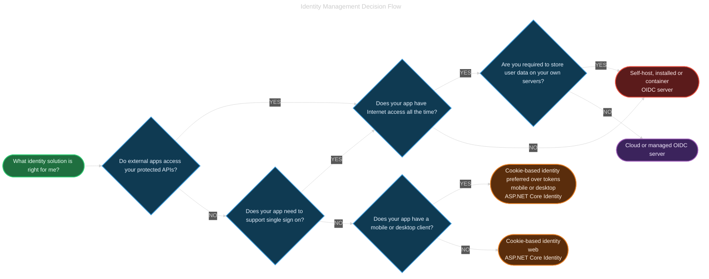
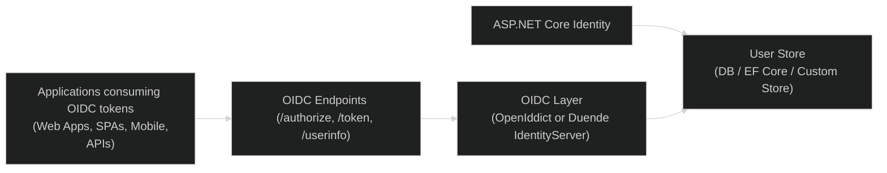

- [Choose an identity management solution](#choose-an-identity-management-solution)
  - [Overview](#overview)
  - [Basic identity management with ASP.NET Core Identity](#basic-identity-management-with-aspnet-core-identity)
  - [Determine if an OIDC server is needed](#determine-if-an-oidc-server-is-needed)
    - [Cookies](#cookies)
    - [Tokens](#tokens)
    - [OIDC Justification](#oidc-justification)
    - [In Short: ASP.NET Core Identity VS OIDC Server](#in-short-aspnet-core-identity-vs-oidc-server)
  - [Disconnected scenarios](#disconnected-scenarios)
  - [Decide where user data such as sign-ins are stored](#decide-where-user-data-such-as-sign-ins-are-stored)
  - [Choosing: Identity vs OIDC server](#choosing-identity-vs-oidc-server)
- [Scaling ASP.NET Core Identity into an OIDC provider](#scaling-aspnet-core-identity-into-an-oidc-provider)
  - [How to turn ASP.NET Core Identity into an OIDC provider](#how-to-turn-aspnet-core-identity-into-an-oidc-provider)
    - [1) Duende IdentityServer (recommended, enterprise-grade)](#1-duende-identityserver-recommended-enterprise-grade)
    - [2) OpenIddict (fully free \& open-source)](#2-openiddict-fully-free--open-source)
    - [3) Older options (not recommended)](#3-older-options-not-recommended)
  - [Typical Architecture](#typical-architecture)
  - [Scaling considerations](#scaling-considerations)
  - [Final Answer](#final-answer)
- [Next steps](#next-steps)

---

<https://learn.microsoft.com/en-us/aspnet/core/security/how-to-choose-identity-solution?view=aspnetcore-8.0>

---

# Choose an identity management solution

## Overview

This guide helps you choose the right identity management solution for your ASP\.NET Core application. Whether you're building a simple web app or a complex distributed system, understanding the trade-offs between different authentication approaches is crucial.

**What you'll learn:**

- When ASP\.NET Core Identity alone is sufficient for your needs
- When you need to implement a full OIDC (OpenID Connect) server
- The differences between cookie-based and token-based authentication
- How to scale identity solutions for enterprise applications
- Whether to self-host or use cloud-based identity services

**Key decision factors:**

- **Single app vs. multiple apps** - Do you need single sign-on (SSO) across applications?
- **API access** - Will third-party applications need to authenticate against your APIs?
- **Connectivity** - Does your application need to work offline or in disconnected scenarios?
- **Data storage** - Where will user credentials be stored (cloud vs. on-premises)?
- **Scale** - What are your scalability and performance requirements?

Most web apps support authentication to ensure that users are who they claim to be. A _user_ might be a person or another app. Management of access ensures users are only able to see and modify the information they're authorized to see and modify.

Identity management solutions are built to handle the requirements of authentication and authorization-related tasks. Many [identity management solutions for .NET web apps](xref:security/identity-management-solutions) are available, each with different capabilities and requirements to use or install.

---

Most web apps support authentication to ensure that users are who they claim to be. A _user_ might be a person or another app. Management of access ensures users are only able to see and modify the information they're authorized to see and modify. For example, an end user shouldn't have access to the administrative section of a website. Identity management solutions are built to handle the requirements of authentication and authorization-related tasks. To learn more about identity management, see [What is identity and access management?](/azure/active-directory/fundamentals/introduction-identity-access-management). Many [identity management solutions for .NET web apps](xref:security/identity-management-solutions) are available, each with different capabilities and requirements to use or install. This article provides guidance on how to choose the right solution.

---

## Basic identity management with ASP\.NET Core Identity

ASP\.NET Core includes the built-in [ASP\.NET Core Identity](xref:security/authentication/identity) authentication provider. The provider includes the APIs, UI, and backend database configuration to support:

- Managing user identities
- Storing user credentials, and
- Granting or revoking permissions.

Additional features include:

- [External logins](xref:security/authentication/social/index)
- [Multi-factor authentication (MFA)](xref:security/authentication/mfa)
- [Password management](xref:security/authentication/accconfirm)
- Account lockout and reactivation
- Authenticator apps

For most scenarios, this may be the only provider needed. In other scenarios, a server or service that manages authentication and identity may be beneficial.

---

## Determine if an OIDC server is needed

- <https://en.wikipedia.org/wiki/OpenID#OpenID_Connect_(OIDC)>
- <https://en.wikipedia.org/wiki/HTTP_cookie>
- <https://en.wikipedia.org/wiki/JSON_Web_Token>

### Cookies

Web apps require a way to _remember_ past actions because the web, by default, is **stateless**. Otherwise, users would be forced to enter their credentials every time they navigated to a new page. The common solution for remembering state is _cookies_, a browser-based mechanism for storing data. The web server sends the initial cookie, then the browser stores it and sends it back with each request. This is done automatically without the need for the developer to write any code. Cookies are easy to use and built into the browser but are designed for use within a single website or web domain.

> The default solution that is built into ASP\.NET Core uses cookie-based authentication.

### Tokens

Tokens are containers with metadata that are explicitly passed through the headers or body of HTTP requests. The main advantage of tokens over cookies is that they are not tied to a specific app or domain. Instead, tokens are usually _signed_ with asymmetric cryptography. For example, OIDC servers issue tokens with information about identity using the [JSON Web Token (JWT)](https://en.wikipedia.org/wiki/JSON_Web_Token) format which includes signing. Asymmetric cryptography uses a combination of a private key known only to the signer, and a public key which everyone can know. Tokens may also be encrypted.

The signed token can't be tampered with due to the private key. The public key:

- Makes it possible to validate the token to ensure it hasn't been changed.
- Guarantees that it was generated by the entity holding the private key.

The main disadvantage to using tokens is that they require a service (typically an OIDC server) to both issue and provide validation for tokens. The service must be installed, configured, and maintained.

### OIDC Justification

A common reason an OIDC server is required is for applications that expose web-based APIs that are consumed by other apps. For exposed web-based APIs, client UIs such as Single Page Applications (SPA), mobile clients, and desktop clients are considered to be part of the same app. SPA examples include Angular, React, and Blazor WebAssembly. If apps other than your web app or any client UIs must make a secure API call to your app, you'll likely want to use tokens. If you only have client UIs, ASP\.NET Core Identity provides the option to acquire a token during authentication. The authentication token issued by ASP\.NET Core Identity:

- Can be used by mobile and desktop clients.
  - Cookies are preferred over tokens for both security and simplicity.
- Isn't suitable for managing access from third-party apps.

Another reason an OIDC server is required is for sharing sign-ins with other apps. Commonly referred to as _single sign on_, this feature enables users to:

- Sign in once with a web app's form.
- Use the resulting credentials to authenticate with other apps without having to sign-in again or choose a different password.

An OIDC server is typically preferred to provide a secure and scalable solution for single sign on.

For apps that don't _share logins_ with other apps, the simplest way to quickly secure an app is to use the built-in **ASP\.NET Core Identity provider**. Otherwise, an OIDC server provided by a third-party identity management solution is needed. OIDC servers are available as:

- Products you install on your server, called _self-host_.
- Containers run in a host like Docker.
- Web-based services you integrate with to manage identity.

Some solutions are free and open source, while others are commercially licensed. The following table provides an overview of various identity management solutions that can be used in ASP\.NET Core apps. These solutions offer features and capabilities to manage user authentication, authorization, and user identity within an app. It includes options for apps that are:

- Container-based
- Self-hosted, where you manage the installation and infrastructure to support it.
- Managed, such as cloud-based services like Microsoft Entra

| Name                                                                        | Type      | License Type                                                                          | Documentation                                                                                  |
| --------------------------------------------------------------------------- | --------- | ------------------------------------------------------------------------------------- | ---------------------------------------------------------------------------------------------- |
| [ASP\.NET Core Identity](https://dotnet.microsoft.com/apps/aspnet)          | Self host | [OSS (MIT)](https://github.com/dotnet/aspnetcore/blob/main/LICENSE.txt)               | [Secure a web app with ASP\.NET Core Identity](/training/modules/secure-aspnet-core-identity/) |
| [Auth0](https://auth0.com/)                                                 | Managed   | [Commercial](https://auth0.com/pricing)                                               | [Get started](https://auth0.com/docs/get-started)                                              |
| [Duende IdentityServer](https://duendesoftware.com/products/identityserver) | Self host | [Commercial](https://duendesoftware.com/products/identityserver#pricing)              | [ASP\.NET Identity integration](https://docs.duendesoftware.com)                               |
| [Keycloak](https://www.keycloak.org)                                        | Container | [OSS (Apache 2.0)](https://github.com/keycloak/keycloak/blob/master/LICENSE.txt)      | [Keycloak securing apps documentation](https://www.keycloak.org/guides#securing-apps)          |
| [Microsoft Entra ID](https://azure.microsoft.com/services/active-directory) | Managed   | [Commercial](https://azure.microsoft.com/pricing/details/active-directory/)           | [Entra documentation](/azure/active-directory/fundamentals/active-directory-whatis)            |
| [Okta](https://www.okta.com)                                                | Managed   | [Commercial](https://www.okta.com/pricing/)                                           | [Okta for ASP\.NET Core](https://developer.okta.com/code/)                                     |
| [OpenIddict](https://github.com/openiddict/openiddict-core)                 | Self host | [OSS (Apache 2.0)](https://github.com/openiddict/openiddict-core/blob/dev/LICENSE.md) | [OpenIddict documentation](https://documentation.openiddict.com/)                              |

It's possible that your organization already uses an identity provider. In that case, it may make sense to use the existing provider instead of going with a different solution. All of the major solutions provide documentation for configuring ASP\.NET Core to use their product or service.

### In Short: ASP\.NET Core Identity VS OIDC Server

- User management (registration, login, roles, MFA, password reset, etc.)
- Cookie-based authentication
- Token generation support (but **not** full OIDC flows)

Identity = user/accounts system
OIDC server = identity provider with endpoints like `/authorize`, `/token`, `/userinfo`, `/jwks`, etc.

Identity does **not** include these OIDC endpoints.

---

## Disconnected scenarios

Many solutions, such as [Microsoft Entra ID](/azure/active-directory/fundamentals/active-directory-whatis), are cloud-based and require an Internet connection to work. If your environment doesn't allow Internet connectivity, you won't be able to use the service.

ASP\.NET Core Identity works perfectly well in disconnected scenarios, such as:

- The app can't access the Internet.
- The app must still function on the local network even if the Internet is disconnected.

If you require a full OIDC server for a disconnected scenario, choose one of the following options:

- A solution that allows you to install and run the service on your own machines.
- Run the authentication service locally as a container.

---

## Decide where user data such as sign-ins are stored

Another important factor to consider is where the user sign-in data is stored. Many developers choose external, cloud-based services like Microsoft Entra ID to manage identity. A cloud-based service provider:

- Takes on the responsibilities of securely storing data.
- Keeps the software up to date with the latest security patches and releases.
- Complies with privacy regulations.

Others prefer to store data on their own servers due to regulations, compliance, policy, or other reasons.

If the data is stored on your servers, you'll most likely need to choose an installable or container-based solution.

---

## Choosing: Identity vs OIDC server

Use the following diagram to help you decide whether to use the ASP\.NET Core Identity system or an OIDC server for authentication and authorization:

The following table lists some of the things to consider when choosing your identity management solution.

| **Feature**                  | **Self-host (infrastructure or container)**                                                                                                                                                                                                                                | **Cloud**                                                                                                                                                                                              |
| ---------------------------- | -------------------------------------------------------------------------------------------------------------------------------------------------------------------------------------------------------------------------------------------------------------------------- | ------------------------------------------------------------------------------------------------------------------------------------------------------------------------------------------------------ |
| **App integration**          | Local solutions that are implemented as libraries or frameworks can often be integrated directly in your own app. Container-based solutions require a hand-off to occur between your web app and the container-based service.                                              | Cloud-based solutions typically integrate at specific points in your sign-in flow and provide configuration to update the UI to match your theme, but the level of customization available is limited. |
| **Configuration**            | Self host solutions require configuring the software for the environment in addition to setting up how you want to manage identities. Container-based solutions typically provide a web-based UI for configuration.                                                        | Cloud-based solutions typically provide a web-based UI for configuration.                                                                                                                              |
| **Customization**            | Self-host solutions are usually highly customizable, including code-based changes. Although containerized solutions provide extensibility options, they are often more limited.                                                                                            | Cloud-based services allow customization, but it's typically limited to configuration-based changes.                                                                                                   |
| **Maintenance**              | Installed products require a dedicated resource to ensure all security patches are applied in a timely fashion and to manage upgrades. The upgrade and patch process for containers is usually lower-friction and involves simply installing the provided container image. | The service provider maintains their cloud-based solution, including applying needed patches and handling upgrades.                                                                                    |
| **User credentials storage** | You are responsible for data governance and handling breaches.                                                                                                                                                                                                             | Managing the risks associated with handling user credentials, and complying with regulations. is delegated to the service provider.                                                                    |

---

# Scaling ASP\.NET Core Identity into an OIDC provider

## How to turn ASP\.NET Core Identity into an OIDC provider

You must integrate an OIDC server framework:

### 1) Duende IdentityServer (recommended, enterprise-grade)

- Full OIDC + OAuth2 server built to sit on top of ASP\.NET Core Identity.
- Commercial license for production.
- Scales extremely well.

### 2) OpenIddict (fully free & open-source)

- Native ASP\.NET Core library.
- Supports all OIDC flows.
- Easy integration with ASP\.NET Core Identity.

### 3) Older options (not recommended)

- IdentityServer4 (no longer maintained for newer .NET versions)

---

## Typical Architecture

Identity handles **users**.
OpenIddict/IdentityServer handles **authorization, tokens, OIDC endpoints**.

---

## Scaling considerations

Using Identity + OpenIddict/IdentityServer you get:

- Horizontal scalability (stateless tokens + distributed cache)
- Support for:

  - Authorization Code flow with PKCE
  - Client credentials
  - Refresh tokens
  - JWT access tokens
  - JWKS endpoint for key rotation

- Multi-tenant architecture support
- Federation (login via Google, Microsoft, Azure AD, etc.)

Yes — with the correct OIDC layer, it scales like any modern identity provider.

---

## Final Answer

ASP\.NET Core Identity **can be used as the foundation of a scalable OIDC server**, but **only when combined with an OIDC framework such as OpenIddict or Duende IdentityServer**. Identity alone is **not** an OIDC provider.

If you want, I can show you:

- A minimal OpenIddict + Identity setup
- A scalable architecture diagram
- A comparison between OpenIddict and Duende IdentityServer

---

# Next steps

- Learn about [JSON Web Tokens](https://auth0.com/docs/secure/tokens/json-web-tokens)
