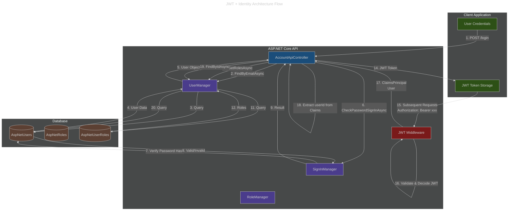
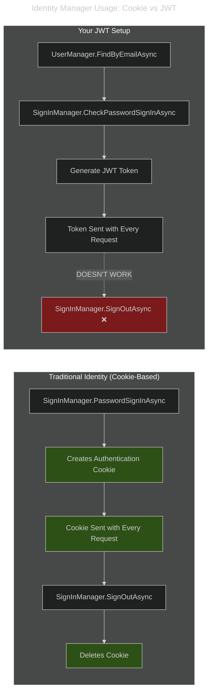
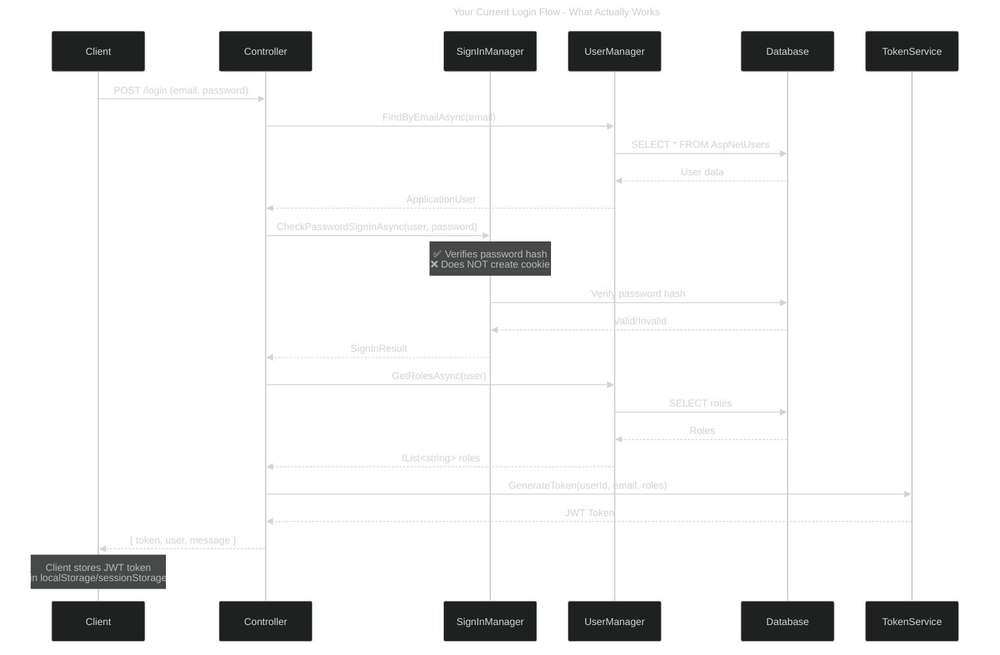
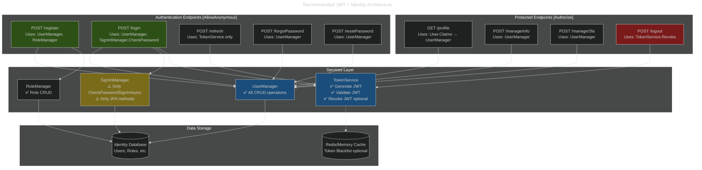

# JWT + ASP.NET Core Identity: Architecture Analysis

## The Problem You've Identified

You're absolutely right to question this! There's a **conceptual mismatch** between:
- **JWT authentication** (stateless, token-based)
- **ASP.NET Core Identity** (designed for cookie-based authentication with server-side sessions)

---

## Architecture Diagram



---

## The Conflict Explained



---

## What Each Component Does

### UserManager (✅ Works Great with JWT)
```csharp
// ✅ GOOD: User management operations
await _userManager.CreateAsync(user, password);
await _userManager.FindByEmailAsync(email);
await _userManager.FindByIdAsync(userId);
await _userManager.GetRolesAsync(user);
await _userManager.AddToRoleAsync(user, role);
await _userManager.ChangePasswordAsync(user, oldPw, newPw);
await _userManager.GenerateEmailConfirmationTokenAsync(user);
await _userManager.ConfirmEmailAsync(user, token);
```

**Purpose:** Database operations on users, roles, passwords, etc.  
**JWT Compatibility:** ✅ Perfect - these are just database operations

---

### SignInManager (⚠️ Partially Useful with JWT)
```csharp
// ✅ GOOD: Password verification
var result = await _signInManager.CheckPasswordSignInAsync(user, password, false);

// ✅ GOOD: Two-factor authentication
var result = await _signInManager.TwoFactorAuthenticatorSignInAsync(code, false, false);

// ❌ BAD: Cookie-based operations (don't work with JWT)
await _signInManager.SignInAsync(user, isPersistent: false);  // Creates cookie
await _signInManager.SignOutAsync();                          // Deletes cookie
await _signInManager.PasswordSignInAsync(email, password, false, false); // Creates cookie
```

**Purpose:** Sign-in operations and cookie management  
**JWT Compatibility:** ⚠️ Only use `CheckPasswordSignInAsync` and 2FA methods

---

### RoleManager (✅ Works Great with JWT)
```csharp
// ✅ GOOD: Role management operations
await _roleManager.CreateAsync(role);
await _roleManager.RoleExistsAsync(roleName);
await _roleManager.FindByNameAsync(roleName);
```

**Purpose:** Database operations on roles  
**JWT Compatibility:** ✅ Perfect - these are just database operations

---

## What's Actually Happening in Your Code



---

## The SignInManager Problem

```csharp
// In your logout endpoint:
[HttpPost("logout")]
public async Task<IActionResult> LogOut()
{
    await _signInManager.SignOutAsync();  // ❌ PROBLEM!
    return Ok(new { Message = "Logged out successfully" });
}
```

### What SignOutAsync Actually Does:
```csharp
// Inside SignInManager.SignOutAsync():
public async Task SignOutAsync()
{
    await Context.SignOutAsync(IdentityConstants.ApplicationScheme);
    // This deletes the authentication cookie
    // But you're using JWT, not cookies!
}
```

### What Happens:
1. **With Cookies:** ✅ Deletes the cookie, user is logged out
2. **With JWT:** ❌ Does nothing useful - JWT is stored client-side, not in a cookie

---

## Recommended Architecture



---

## Fixed Code Examples

### ✅ Correct Login (What You Have)
```csharp
[HttpPost("login")]
[AllowAnonymous]
public async Task<IActionResult> LogIn([FromBody] UserLoginRequest request)
{
    // ✅ Use UserManager for database queries
    var user = await _userManager.FindByEmailAsync(request.Email);
    if (user == null)
        return Unauthorized(new { Message = "Invalid credentials" });

    // ✅ Use SignInManager ONLY for password verification
    var result = await _signInManager.CheckPasswordSignInAsync(
        user, request.Password, lockoutOnFailure: false);
    
    if (!result.Succeeded)
        return Unauthorized(new { Message = "Invalid credentials" });

    // ✅ Use UserManager for roles
    var roles = await _userManager.GetRolesAsync(user);
    
    // ✅ Generate JWT (not a cookie!)
    var token = _tokenService.GenerateToken(user.Id, user.Email!, roles);

    return Ok(new UserLoginResponse { Token = token, User = ... });
}
```

### ❌ Wrong Logout (What You Currently Have)
```csharp
[HttpPost("logout")]
public async Task<IActionResult> LogOut()
{
    await _signInManager.SignOutAsync();  // ❌ Deletes cookie (you don't have cookies!)
    return Ok();
}
```

### ✅ Correct Logout Options

#### Option 1: Simple Logging
```csharp
[HttpPost("logout")]
public IActionResult LogOut()
{
    var userId = User.FindFirstValue(ClaimTypes.NameIdentifier);
    _logger.LogInformation("User {UserId} logged out", userId);
    return Ok(new { Message = "Logged out successfully" });
}
```

#### Option 2: Token Revocation (Advanced)
```csharp
[HttpPost("logout")]
public async Task<IActionResult> LogOut()
{
    var userId = User.FindFirstValue(ClaimTypes.NameIdentifier);
    var token = HttpContext.Request.Headers["Authorization"]
        .ToString().Replace("Bearer ", "");
    
    // ✅ Use TokenService to blacklist the token
    await _tokenService.RevokeTokenAsync(token);
    
    _logger.LogInformation("User {UserId} logged out and token revoked", userId);
    return Ok(new { Message = "Logged out successfully" });
}
```

---

## When to Use Each Component

### UserManager - Use for:
- ✅ Creating users
- ✅ Finding users by email/ID
- ✅ Getting/setting user properties
- ✅ Password operations (change, reset, verify)
- ✅ Email confirmation
- ✅ Phone number confirmation
- ✅ Two-factor authentication setup
- ✅ Managing user roles
- ✅ Managing user claims

### SignInManager - Use ONLY for:
- ✅ `CheckPasswordSignInAsync()` - verify password
- ✅ `TwoFactorAuthenticatorSignInAsync()` - 2FA verification
- ✅ `TwoFactorRecoveryCodeSignInAsync()` - recovery code verification
- ❌ ~~SignInAsync()~~ - creates cookie (not for JWT)
- ❌ ~~SignOutAsync()~~ - deletes cookie (not for JWT)
- ❌ ~~PasswordSignInAsync()~~ - creates cookie (not for JWT)

### RoleManager - Use for:
- ✅ Creating roles
- ✅ Checking if role exists
- ✅ Finding roles
- ✅ Deleting roles

### TokenService (Custom) - Use for:
- ✅ Generating JWT tokens
- ✅ Validating JWT tokens (if needed)
- ✅ Revoking JWT tokens (optional)
- ✅ Generating refresh tokens (optional)

---

## Summary

**Is it a problem?** Yes and No:

### ❌ Problems:
1. `SignInManager.SignOutAsync()` does nothing useful with JWT
2. Creates confusion about what's cookie-based vs token-based
3. Some SignInManager methods are useless for JWT

### ✅ Not Problems:
1. Using `UserManager` is **perfect** - it's just a database layer
2. Using `RoleManager` is **perfect** - it's just a database layer
3. Using `SignInManager.CheckPasswordSignInAsync()` is **fine** - it verifies passwords

### 🎯 Solution:
- **Keep:** UserManager, RoleManager, SignInManager.CheckPasswordSignInAsync
- **Remove:** SignInManager.SignOutAsync and other cookie-based methods
- **Add:** Custom token revocation if you need server-side logout

---

## Conclusion

ASP.NET Core Identity is **perfectly fine to use with JWT** as long as you understand:
- **UserManager** = Database operations (always useful)
- **RoleManager** = Database operations (always useful)  
- **SignInManager** = Mostly cookie operations (only use password/2FA verification methods)

Your architecture is **80% correct**. Just remove/fix the `SignOutAsync()` call and you're golden! 🎉
