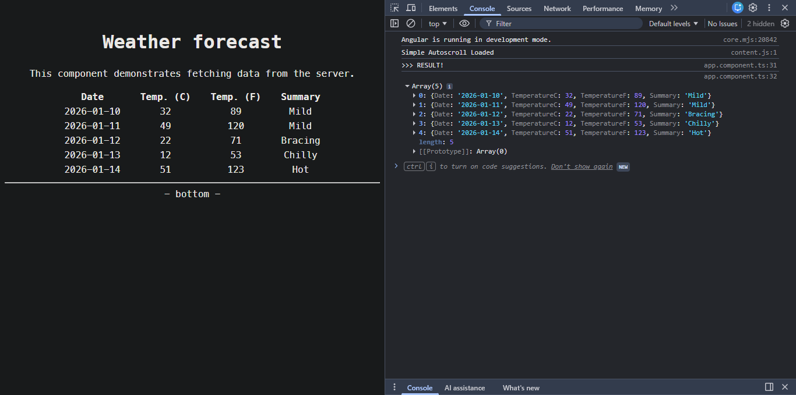

- [Development Set-Up](#development-set-up)
  - [NET Core Development](#net-core-development)
  - [Angular Development](#angular-development)
    - [Install Node](#install-node)
    - [Install Angular](#install-angular)
    - [Running SPA from NET Core](#running-spa-from-net-core)

---

# Development Set-Up

## NET Core Development

- <https://dotnet.microsoft.com/en-us/download/dotnet>

Specific NET Core version installation:

- In Windows:

  ```powershell
  winget install Microsoft.DotNet.SDK.8 --version 8.0.100
  ```

For running EF Core migrations correctly, get the correct tool versions:

```powershell
> dotnet tool uninstall --global dotnet-ef
> dotnet tool install --global dotnet-ef --version 8.0.22
```

Add correct packages:

```powershell
dotnet add package Microsoft.EntityFrameworkCore.SqlServer --version 8.0.22
dotnet add package Microsoft.EntityFrameworkCore.Tools --version 8.0.22
dotnet add package Microsoft.EntityFrameworkCore.Design --version 8.0.22
```

---

## Angular Development

- Angular development set-up in NET Core is explained at [](troubleshooting.md)

### Install Node

- Install: <https://nodejs.org/en/download>
- Or better:

  - In Mac/Linux: <https://github.com/nvm-sh/nvm>
  - In Windows: <https://github.com/coreybutler/nvm-windows/>

    - Usage:

      ```console
      > nvm list
      > nvm install lts
      > nvm install 19
      > nvm use 19
      ```

You can install multiple Node versions.

### Install Angular

Commands:

```console
> npm install -g @angular/cli@19.2.0
> ng version
> ng serve
```

### Running SPA from NET Core

1. Install the dependency:

```terminal
dotnet add package Microsoft.AspNetCore.SpaProxy --version 10.0.1
```

2. At `BasicNtierTemplate.API\Properties\launchSettings.json`, uncomment lines:

```json
"ASPNETCORE_HOSTINGSTARTUPASSEMBLIES": "Microsoft.AspNetCore.SpaProxy"
```

3. At `BasicNtierTemplate.API\BasicNtierTemplate.API.csproj` uncomment:

```xml
<!-- Angular Project
-->
<SpaProxyLaunchCommand>npm start</SpaProxyLaunchCommand>
<SpaRoot>..\BasicNtierTemplate.Web.Angular</SpaRoot>
<SpaProxyServerUrl>https://localhost:5021</SpaProxyServerUrl>
```

4. When debugging `BasicNtierTemplate.API`, the Angular SPA will be launched (`BasicNtierTemplate.Web.Angular`).

Working demo page, fetching data from API layer to Angular layer:


