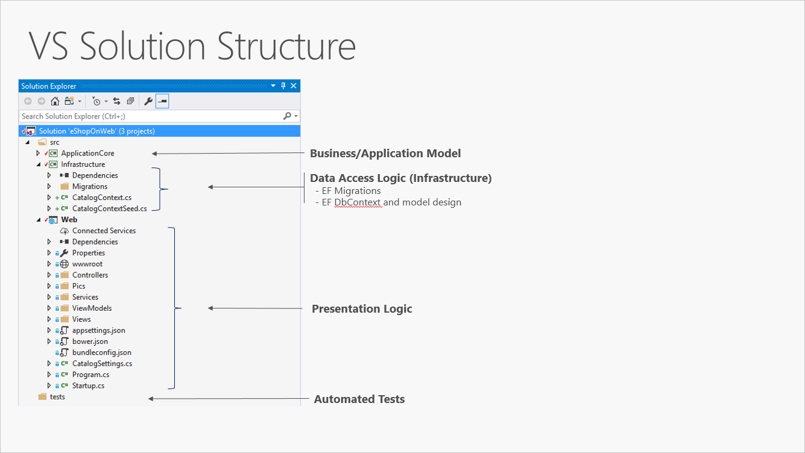

- [Basic N-Layer Architecture](#basic-n-layer-architecture)
	- [Traditional “N-Layer” architecture applications](#traditional-n-layer-architecture-applications)

---

# Basic N-Layer Architecture

| Layer             | Abbreviation                 | Description                                  |
| ----------------- | ---------------------------- | -------------------------------------------- |
| `Web`             | _UI_                         | Presentation                                 |
| `ApplicationCore` | _BLL_ (Business Logic Layer) | Business/Application Model                   |
| `Infrastructure`  | _DAL_ (Data Access Layer)    | EF Migrations, EF DbContext and model design |

- Automated tests can also be included in a separate section.

## Traditional “N-Layer” architecture applications

These layers are frequently abbreviated as UI, BLL (Business Logic Layer), and DAL (Data Access Layer). Using this architecture, users make requests through the UI layer, which interacts only with the BLL. The BLL, in turn, can call the DAL for data access requests. The UI layer shouldn’t make any requests to the DAL directly, nor should it interact with persistence directly through other means. Likewise, the BLL should only interact with persistence by going through the DAL. In this way, each layer has its own well-known responsibility.

One disadvantage of this traditional layering approach is that compile-time dependencies run from the top to the bottom. That is, the UI layer depends on the BLL, which depends on the DAL. This means that the BLL, which usually holds the most important logic in the application, is dependent on data access implementation details (and often on the existence of a database). Testing business logic in such an architecture is often difficult, requiring a test database. The dependency inversion principle can be used to address this issue.

