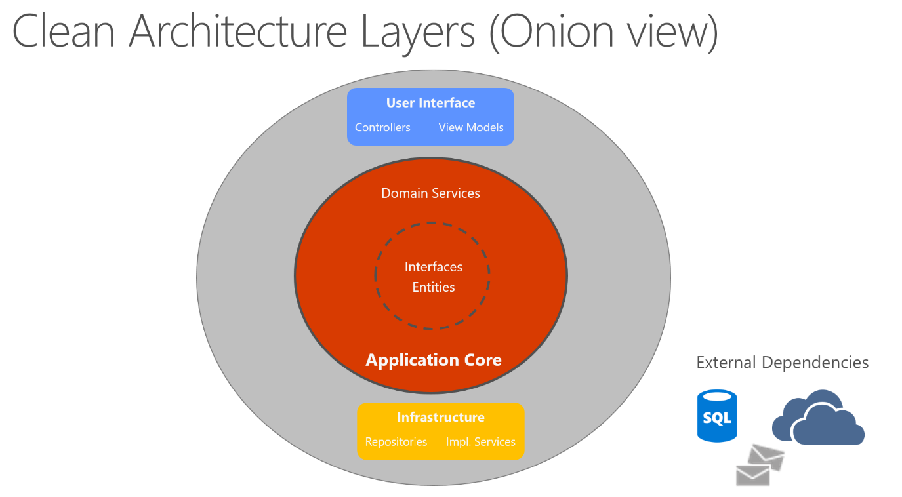
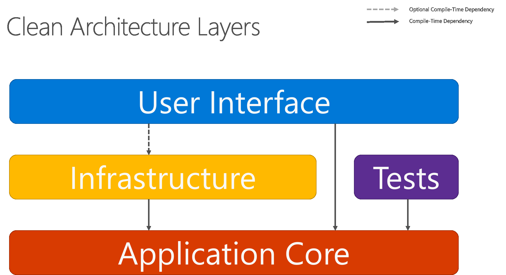
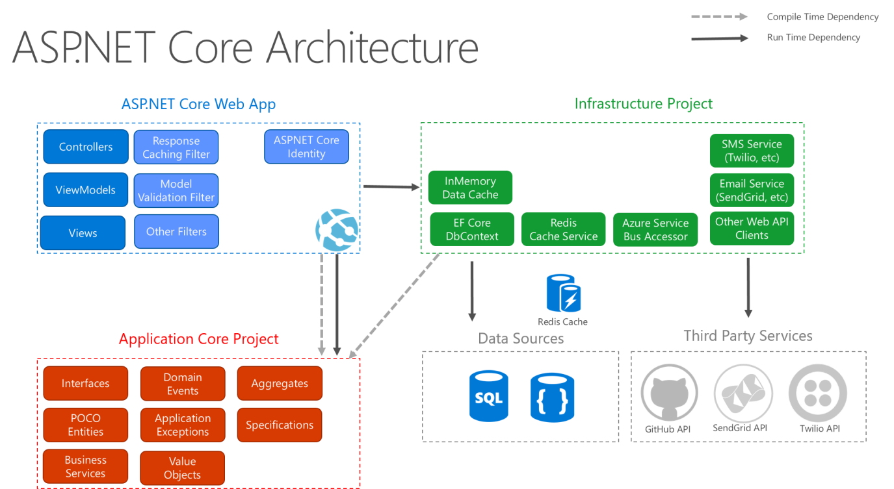
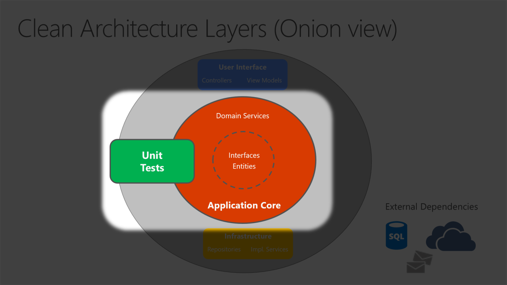

- [Clean Architecture](#clean-architecture)
    - [1. Overview](#1-overview)
    - [2. Layer Description: Organizing Code in Clean Architecture](#2-layer-description-organizing-code-in-clean-architecture)
        - [2.1 Application Core](#21-application-core)
        - [2.2 Infrastructure](#22-infrastructure)
        - [2.3 UI Layer](#23-ui-layer)
    - [References](#references)

---

Here's the document with improved formatting, applying your markdown rules:

---

# Clean Architecture

---

## 1. Overview

Clean Architecture is the latest in a series of names for the same loosely-coupled, dependency-inverted architecture. You will also find it named hexagonal, ports-and-adapters, or onion architecture.

Clean architecture puts the business logic and application model at the center of the application. Instead of having business logic depend on data access or other infrastructure concerns, this dependency is inverted: infrastructure and implementation details depend on the Application Core. This is achieved by defining abstractions, or interfaces, in the Application Core, which are then implemented by types defined in the Infrastructure layer.

In this diagram, dependencies flow toward the innermost circle. The Application Core takes its name from its position at the core of this diagram, and has no dependencies on other application layers. The application's entities and interfaces are at the very center. Just outside, but still in the Application Core, are domain services, which typically implement interfaces defined in the inner circle. Outside of the Application Core, both the UI and the Infrastructure layers depend on the Application Core, but not on one another.

Solid arrows represent compile-time dependencies, while the dashed arrow represents a runtime-only dependency. With Clean Architecture, the UI layer works with interfaces defined in the Application Core at compile time, and ideally shouldn't know about the implementation types defined in the Infrastructure layer. At run time, however, these implementation types are required for the app to execute, so they need to be present and wired up to the Application Core interfaces via dependency injection.

Because the Application Core doesn't depend on Infrastructure, it's very easy to write automated unit tests for this layer.

Since the UI layer doesn't have any direct dependency on types defined in the Infrastructure project, it's likewise very easy to swap out implementations, either to facilitate testing or in response to changing application requirements. ASP\.NET Core's built-in use of and support for dependency injection makes this architecture the most appropriate way to structure non-trivial monolithic applications.

---

## 2. Layer Description: Organizing Code in Clean Architecture

In a Clean Architecture solution, each project has clear responsibilities. Certain types belong in each project, and you'll frequently find folders corresponding to these types in the appropriate project.

### 2.1 Application Core

The Application Core holds the business model, which includes entities, services, and interfaces. These interfaces include abstractions for operations that will be performed using Infrastructure, such as data access, file system access, network calls, etc. Sometimes services or interfaces defined at this layer will need to work with non-entity types that have no dependencies on UI or Infrastructure. These can be defined as simple Data Transfer Objects (DTOs).

**Application Core types:**

| Type                                | Description                                |
| ----------------------------------- | ------------------------------------------ |
| Entities                            | Business model classes that are persisted  |
| Aggregates                          | Groups of entities                         |
| Interfaces                          | Abstractions for infrastructure operations |
| Domain Services                     | Implement interfaces from the inner circle |
| Specifications                      | Query/filter encapsulation                 |
| Custom Exceptions and Guard Clauses | Error and validation handling              |
| Domain Events and Handlers          | Reactive domain logic                      |

### 2.2 Infrastructure

The Infrastructure project typically includes data access implementations. In a typical ASP\.NET Core web application, these implementations include the Entity Framework (EF) DbContext, any EF Core Migration objects that have been defined, and data access implementation classes. The most common way to abstract data access implementation code is through the use of the Repository design pattern.

In addition to data access implementations, the Infrastructure project should contain implementations of services that must interact with infrastructure concerns. These services should implement interfaces defined in the Application Core, and so Infrastructure should have a reference to the Application Core project.

**Infrastructure types:**

| Type                             | Description                       |
| -------------------------------- | --------------------------------- |
| EF Core types                    | DbContext, Migration objects      |
| Data access implementations      | Repository classes                |
| Infrastructure-specific services | e.g. `FileLogger`, `SmtpNotifier` |

### 2.3 UI Layer

The user interface layer in an ASP\.NET Core MVC application is the entry point for the application. This project should reference the Application Core project, and its types should interact with infrastructure strictly through interfaces defined in Application Core. No direct instantiation of or static calls to the Infrastructure layer types should be allowed in the UI layer.

**UI Layer types:**

| Type                 | Description                            |
| -------------------- | -------------------------------------- |
| Controllers          | Handle HTTP requests                   |
| Custom Filters       | Cross-cutting action logic             |
| Custom Middleware    | Pipeline request processing            |
| Views                | UI templates                           |
| ViewModels           | Data shapes for views                  |
| Startup / Program.cs | App configuration and composition root |

The `Startup` class or `Program.cs` file is responsible for configuring the application and wiring up implementation types to interfaces. The place where this logic is performed is known as the app's **composition root**, and is what allows dependency injection to work properly at run time.

> **Note:** To wire up dependency injection during app startup, the UI layer project may need to reference the Infrastructure project. This dependency can be eliminated, most easily by using a custom DI container that has built-in support for loading types from assemblies. For the purposes of this sample, the simplest approach is to allow the UI project to reference the Infrastructure project — but developers should limit actual references to types in the Infrastructure project to the app's composition root.

---

## References

- _Architecting Modern Web Applications with ASP\.NET Core and Microsoft Azure_, by Steve "Ardalis" Smith.
