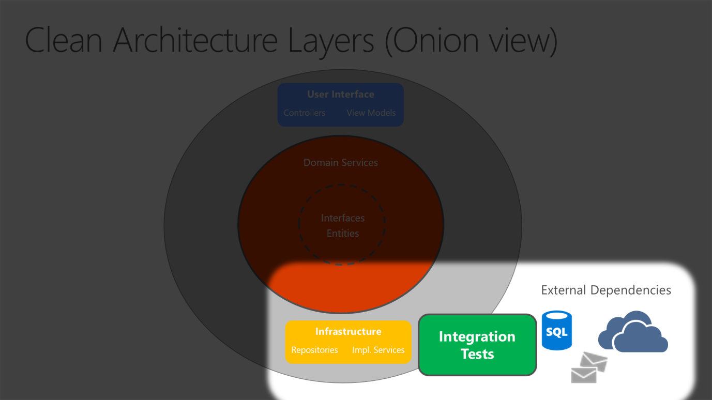

- [Clean Architecture](#clean-architecture)

---

# Clean Architecture

Clean Architecture is just the latest in a series of names for the same loosely-coupled, dependency-inverted architecture. You will also find it named hexagonal, ports-and-adapters, or onion architecture.

Clean architecture puts the business logic and application model at the center of the application. Instead of having business logic depend on data access or other infrastructure concerns, this dependency is inverted: infrastructure and implementation details depend on the Application Core. This functionality is achieved by defining abstractions, or interfaces, in the Application Core, which are then implemented by types defined in the Infrastructure layer.

In this diagram, dependencies flow toward the innermost circle. The Application Core takes its name from its position at the core of this diagram. And you can see on the diagram that the Application Core has no dependencies on other application layers. The application's entities and interfaces are at the very center. Just outside, but still in the Application Core, are domain services, which typically implement interfaces defined in the inner circle. Outside of the Application Core, both the UI and the Infrastructure layers depend on the Application Core, but not on one another (necessarily).

Note that the solid arrows represent compile-time dependencies, while the dashed arrow represents a runtime-only dependency. With the clean architecture, the UI layer works with interfaces defined in the Application Core at compile time, and ideally shouldn't know about the implementation types defined in the Infrastructure layer. At run time, however, these implementation types are required for the app to execute, so they need to be present and wired up to the Application Core interfaces via dependency injection.

Because the Application Core doesn't depend on Infrastructure, it's very easy to write automated unit tests for this layer. Figures 5-10 and 5-11 show how tests fit into this architecture.

Since the UI layer doesn't have any direct dependency on types defined in the Infrastructure project, it's likewise very easy to swap out implementations, either to facilitate testing or in response to changing application requirements. ASP.NET Core's built-in use of and support for dependency injection makes this architecture the most appropriate way to structure non-trivial monolithic applications.