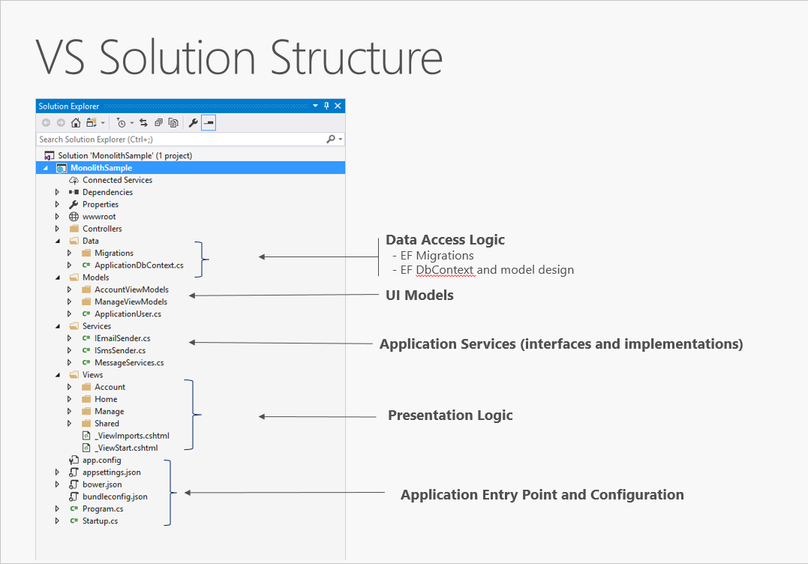

- [Modular Monolithic Architecture](#modular-monolithic-architecture)
	- [What is a monolithic application?](#what-is-a-monolithic-application)
	- [All-in-one applications](#all-in-one-applications)

---

# Modular Monolithic Architecture

<https://learn.microsoft.com/en-us/dotnet/architecture/modern-web-apps-azure/common-web-application-architectures>

## What is a monolithic application?

A monolithic application is one that is entirely self-contained, in terms of its behavior. It may interact with other services or data stores in the course of performing its operations, but the core of its behavior runs within its own process and the entire application is typically deployed as a single unit. If such an application needs to scale horizontally, typically the entire application is duplicated across multiple servers or virtual machines.

## All-in-one applications

The smallest possible number of projects for an application architecture is one. In this architecture, the entire logic of the application is contained in a single project, compiled to a single assembly, and deployed as a single unit.

A new ASP\.NET Core project, whether created in Visual Studio or from the command line, starts out as a simple "all-in-one" monolith. It contains all of the behavior of the application, including presentation, business, and data access logic. Figure 5-1 shows the file structure of a single-project app.

In a single project scenario, separation of concerns is achieved through the use of folders. The default template includes separate folders for MVC pattern responsibilities of Models, Views, and Controllers, as well as additional folders for Data and Services. In this arrangement, presentation details should be limited as much as possible to the Views folder, and data access implementation details should be limited to classes kept in the Data folder. Business logic should reside in services and classes within the Models folder.

Although simple, the single-project monolithic solution has some disadvantages. As the project's size and complexity grows, the number of files and folders will continue to grow as well. User interface (UI) concerns (models, views, controllers) reside in multiple folders, which aren't grouped together alphabetically. This issue only gets worse when additional UI-level constructs, such as Filters or ModelBinders, are added in their own folders. Business logic is scattered between the Models and Services folders, and there's no clear indication of which classes in which folders should depend on which others. This lack of organization at the project level frequently leads to spaghetti code.

To address these issues, applications often evolve into multi-project solutions, where each project is considered to reside in a particular layer of the application.